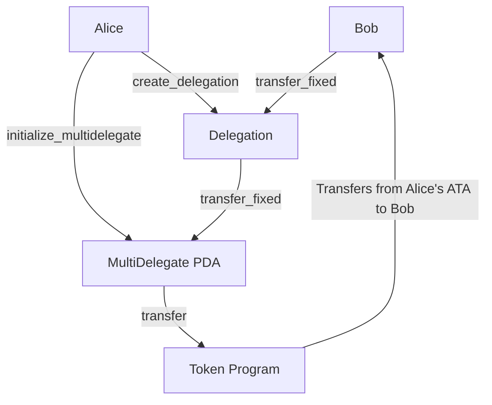
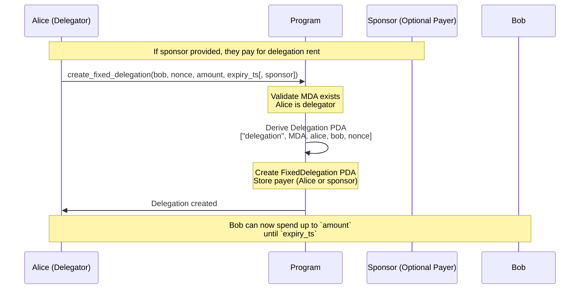
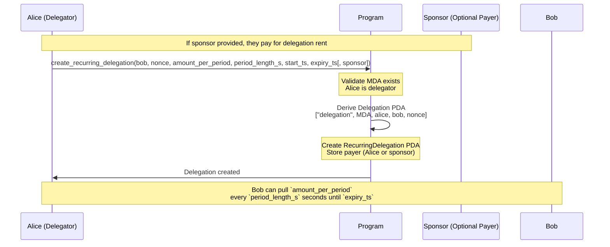
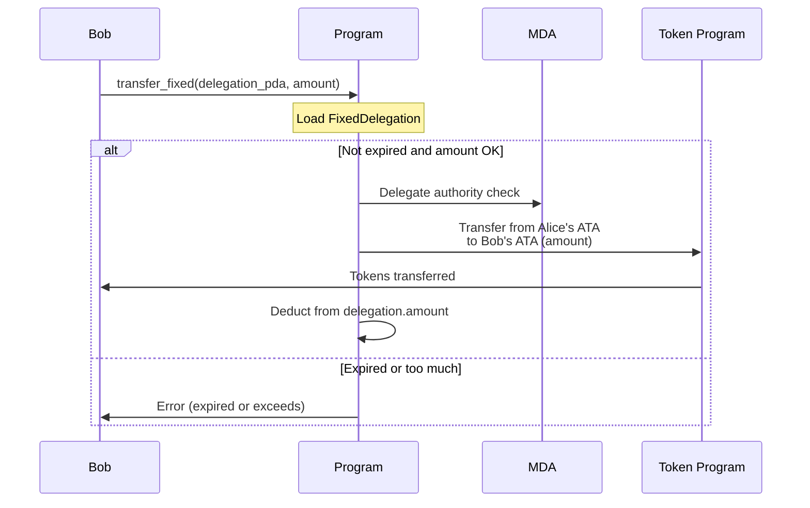
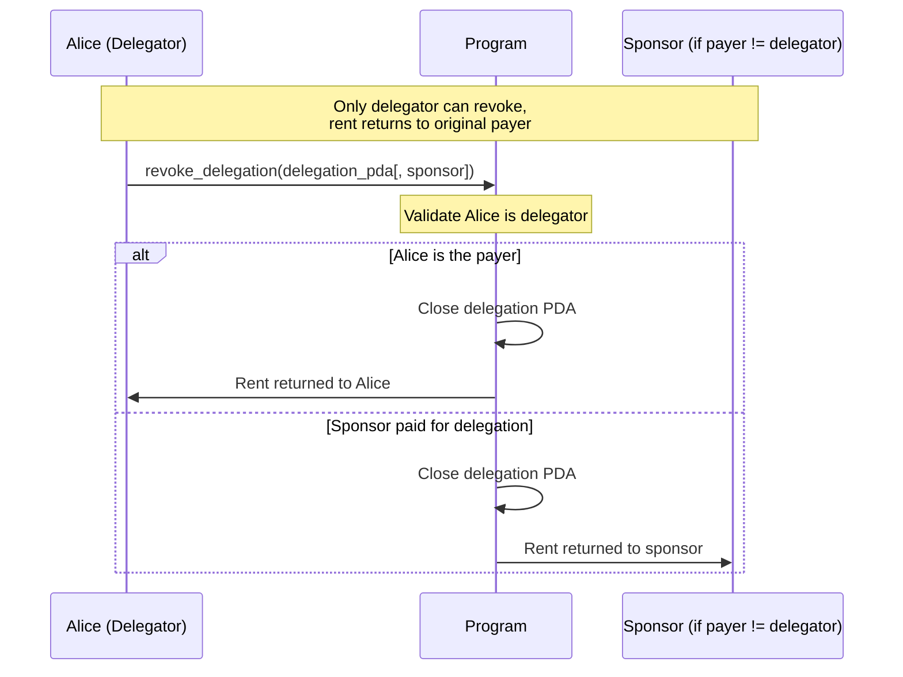

# ADR-001: Multi-Delegator Program Architecture

**Status:** Implemented

## Context

Solana's SPL Token delegate model allows only **one delegate per token account**. This creates friction for:

- P2P delegations where users want to authorize friends/services to spend on their behalf
- Multiple simultaneous payment authorizations from a single token account
- Need for controlled, recurring payments with enforceable limits

## Decision

We implement a **single-track delegation model** that provides:

1. **MultiDelegate Authority (MDA)**: A programmatic delegate with unlimited token approval authority (`u64::MAX`) over user token accounts
2. **Delegation PDAs**: Individual constraints governing MDA spending behavior
3. **Delegation Types**: Fixed (one-time with expiry) and Recurring (periodic pulls with limits)
4. **Tech Stack**: Pinocchio framework, Codama for IDL generation and TypeScript/Rust client generation

**Key Design**: MDA receives unlimited approval, but can only transfer when Delegation PDA constraints allow. The program validates constraints before executing transfers, making the system as secure as traditional approval-based delegations while enabling multi-delegation capabilities.

## Architecture Overview

### Fixed Delegation Flow

At a high level, Alice will first create a MultiDelegatePDA which she will give the power to transfer tokens on her behalf.
After this, she will be able to create `Delegations` of different kinds to different users.

Once she creates a Delegation for Bob, he will be able to perform transfers through the program.
The multidelegate program will perform the relevant checks depending on the type of delegation between Alice and Bob.



### Initialization: User Creates MDA


### Fixed Delegation: User Creates for Bob



### Recurring Delegation: User Creates for Bob



### Transfer Execution: Fixed Delegation



### Revocation: Alice Closes Delegation



---

### MultiDelegate Authority (MDA)

Each user creates one MDA per token mint with seeds `["MultiDelegate", user, mint]`. The MDA:

1. Receives `u64::MAX` delegated approval from the user's ATA
2. Acts as the delegate for all transfers from that user's account
3. Cannot transfer on its own - requires active Delegation PDA to authorize

### Delegate Discovery

Delegates discover their delegations via `getProgramAccounts` with `memcmp` filter on the `delegatee` field at byte offset 35 (`DELEGATEE_OFFSET`):

```typescript
// Delegatee discovers Bob's delegations:
getProgramAccounts(PROGRAM_ID, {
  filters: [{ memcmp: { offset: DELEGATEE_OFFSET, bytes: bobPubkey } }],
});
```

## Instructions

### Initialization

| Instruction                | Actor     | Purpose                                              |
| -------------------------- | --------- | ---------------------------------------------------- |
| `initialize_multidelegate` | Delegator | Create MDA and approve `u64::MAX` delegate authority |
| `close_multidelegate`      | Delegator | Close MDA account and return rent                    |

### Delegation Management

| Instruction                   | Actor     | Purpose                                                                             |
| ----------------------------- | --------- | ----------------------------------------------------------------------------------- |
| `create_fixed_delegation`     | Delegator | Create one-time delegation with nonce, amount, and expiry (payer can be sponsor)     |
| `create_recurring_delegation` | Delegator | Create recurring delegation with period limits (payer can be sponsor)              |
| `revoke_delegation`           | Delegator | Close a delegation account and return rent to the original payer (delegator/sponsor) |

### Transfer

| Instruction          | Actor     | Purpose                                                                 |
| -------------------- | --------- | ----------------------------------------------------------------------- |
| `transfer_fixed`     | Delegatee | Execute token transfer for a fixed delegation, enforcing limits         |
| `transfer_recurring` | Delegatee | Execute token transfer for a recurring delegation, enforcing period limits |

---

## Types

```rust
#[repr(u8)]
pub enum AccountDiscriminator {
    MultiDelegate = 0,
    Plan = 1,
    FixedDelegation = 2,
    RecurringDelegation = 3,
    SubscriptionDelegation = 4,
}
```

### MultiDelegate

The MultiDelegate PDA stores the delegator and mint information:

```rust
#[repr(C, packed)]
pub struct MultiDelegate {
    pub discriminator: u8,    // 1 byte - AccountDiscriminator::MultiDelegate
    pub user: Address,        // 32 bytes - delegator key
    pub token_mint: Address,  // 32 bytes - mint this MDA controls
    pub bump: u8,             // 1 byte
    pub init_id: i64,         // 8 bytes - slot-based generation identifier
}

impl MultiDelegate {
    pub const SEED: &[u8] = b"MultiDelegate";
    pub const LEN: usize = 74;

    pub fn find_pda(user: &Address, token_mint: &Address) -> (Address, u8) {
        Address::find_program_address(
            &[Self::SEED, user.as_ref(), token_mint.as_ref()],
            &crate::ID,
        )
    }
}
```

**PDA seeds**: `["MultiDelegate", delegator_key, mint_key]`

> **Note (init_id):** The `init_id` field is set from `Clock::slot` when the account is created.
> Every delegation header stores a copy of this value. On transfer, the program validates
> `header.init_id == multidelegate.init_id`. If a user closes and re-initializes their
> MultiDelegate, the new slot produces a different `init_id`, making all old delegations
> non-transferable (error: `StaleMultiDelegate`). This prevents orphaned delegations from
> being revived and also makes closing an effective emergency kill switch.

### Header

Shared header for all delegation types (FixedDelegation, RecurringDelegation, SubscriptionDelegation):

```rust
#[repr(C, packed)]
pub struct Header {
    pub discriminator: u8,  // 1 byte - AccountDiscriminator variant
    pub version: u8,        // 1 byte - account format version (see ADR-003)
    pub bump: u8,           // 1 byte - PDA bump seed
    pub delegator: Address, // 32 bytes - user granting delegation
    pub delegatee: Address, // 32 bytes - beneficiary
    pub payer: Address,     // 32 bytes - who paid for the delegation account
    pub init_id: i64,       // 8 bytes - copied from MultiDelegate.init_id at creation
}

impl Header {
    pub const LEN: usize = 107;
}
```

Field offsets are defined as standalone constants in `state/header.rs`:
- `DISCRIMINATOR_OFFSET = 0`
- `VERSION_OFFSET = 1`
- `BUMP_OFFSET = 2`
- `DELEGATOR_OFFSET = 3`
- `DELEGATEE_OFFSET = 35`
- `PAYER_OFFSET = 67`
- `INIT_ID_OFFSET = 99`

### FixedDelegation

One-time delegation with explicit amount and expiry:

```rust
#[repr(C, packed)]
pub struct FixedDelegation {
    pub header: Header,     // 99 bytes
    pub amount: u64,        // 8 bytes - remaining pullable amount
    pub expiry_ts: i64,     // 8 bytes - Unix timestamp (0 = no expiry)
}

impl FixedDelegation {
    pub const LEN: usize = 115;
}
```

**PDA seeds**: `["delegation", multi_delegate, delegator, delegatee, nonce]`

**Use cases**: One-time payments, time-limited allowances, gift delegations

### RecurringDelegation

Recurring delegation with period tracking:

```rust
#[repr(C, packed)]
pub struct RecurringDelegation {
    pub header: Header,              // 99 bytes
    pub current_period_start_ts: i64, // 8 bytes - start of current period
    pub period_length_s: u64,         // 8 bytes - seconds per period
    pub expiry_ts: i64,               // 8 bytes - delegation expiry (0 = no expiry)
    pub amount_per_period: u64,       // 8 bytes - max per period
    pub amount_pulled_in_period: u64, // 8 bytes - tracking
}

impl RecurringDelegation {
    pub const LEN: usize = 139;
}
```

**PDA seeds**: Same as FixedDelegation

**Use cases**: Subscription payments, recurring allowances, salary-style disbursements

---

## Instruction Details

### `initialize_multidelegate` (Discriminator: 0)

Creates the MDA and grants it `u64::MAX` delegated approval over the user's ATA.

| Account | Type             | Description                 |
| ------- | ---------------- | --------------------------- |
| 0       | signer, writable | The delegator (user)        |
| 1       | writable         | MultiDelegate PDA to create |
| 2       | mint             | Token mint for this MDA     |
| 3       | writable         | User's ATA to approve       |
| 4       | system_program   | System program              |
| 5       | token_program    | Token program               |

**Process:**

1. Validate MDA PDA address derived from `["MultiDelegate", user, mint]`
2. Create MDA account with delegator and mint data
3. Call `Approve { source: user_ata, delegate: multi_delegate, authority: user, amount: u64::MAX }`

### `create_fixed_delegation` (Discriminator: 1)

Creates a one-time delegation with nonce-based PDA.

| Account | Type             | Description                            |
| ------- | ---------------- | -------------------------------------- |
| 0       | signer, writable | The delegator creating this delegation |
| 1       |                  | MultiDelegate PDA for this token type  |
| 2       | writable         | FixedDelegation PDA being created      |
| 3       |                  | The delegatee (beneficiary)            |
| 4       | system_program   | System program                         |
| 5       | signer, writable | The payer who funds the delegation account (optional, defaults to delegator) |

**Parameters:**

- `nonce: u64` - Unique identifier to create distinct PDAs for same (delegator, delegatee) pair
- `amount: u64` - Maximum amount transferable
- `expiry_ts: i64` - Unix timestamp when delegation expires

**Process:**

1. Validate MultiDelegate exists and belongs to delegator
2. Derive and validate Delegation PDA from `["delegation", multi_delegate, delegator, delegatee, nonce]`
3. Create Delegation account with header and terms

### `create_recurring_delegation` (Discriminator: 2)

Creates a recurring delegation with period tracking.

| Account | Type             | Description                            |
| ------- | ---------------- | -------------------------------------- |
| 0       | signer, writable | The delegator creating this delegation |
| 1       |                  | MultiDelegate PDA for this token type  |
| 2       | writable         | RecurringDelegation PDA being created  |
| 3       |                  | The delegatee (beneficiary)            |
| 4       | system_program   | System program                         |
| 5       | signer, writable | The payer who funds the delegation account (optional, defaults to delegator) |

**Parameters:**

- `nonce: u64` - Unique identifier
- `amount_per_period: u64` - Maximum amount per period
- `period_length_s: u64` - Seconds in each period
- `start_ts: i64` - Timestamp when the first period starts
- `expiry_ts: i64` - Delegation expiry timestamp

**Process:**

1. Validate MultiDelegate exists and belongs to delegator
2. Derive and validate Delegation PDA with nonce
3. Create Delegation account with header and terms
4. Initialize `current_period_start_ts` to `start_ts`
5. Initialize `amount_pulled_in_period` to 0

### `revoke_delegation` (Discriminator: 3)

Revokes a delegation by closing the delegation PDA and returning rent to the original payer.

| Account | Type     | Description                                                                 |
| ------- | -------- | --------------------------------------------------------------------------- |
| 0       | signer, writable | The delegator (authority)                                        |
| 1       | writable | Delegation PDA to close                                                    |
| 2       | writable | Receiver account (required only if payer != delegator)                     |

**Process:**

1. Validate that the signer matches the `delegator` field in the delegation header
2. Determine rent destination: if payer == delegator, use delegator account; otherwise, use provided receiver account
3. Close the delegation account
4. Transfer rent lamports back to the original payer (delegator or sponsor)

### `close_multidelegate` (Discriminator: 6)

Closes a MultiDelegate PDA and returns rent to the owner.

| Account | Type             | Description                                |
| ------- | ---------------- | ------------------------------------------ |
| 0       | signer, writable | The user who owns the MultiDelegate PDA    |
| 1       | writable         | MultiDelegate PDA to close                 |

**Process:**

1. Verify signer matches the MDA's `user` field
2. Verify PDA derivation from `["MultiDelegate", user, token_mint]`
3. Close account and transfer lamports to user

> **Emergency kill switch:** Closing does not revoke existing delegation PDAs, but they
> become non-transferable because the MultiDelegate account no longer exists. If the user
> re-initializes, the new `init_id` invalidates all old delegations. This allows a user
> to immediately cut off all delegatees in a single transaction without revoking each one
> individually. The delegator can still call `revoke_delegation` on orphaned delegations
> afterward to reclaim rent.

---

## Spend/Transfer Design

The transfer mechanism uses specific instructions for each delegation type to validate constraints before allowing the MDA to transfer tokens.

### `transfer_fixed` (Discriminator: 4)

Executes a transfer for a fixed delegation.

| Account | Type             | Description                                |
| ------- | ---------------- | ------------------------------------------ |
| 0       | writable         | FixedDelegation PDA                        |
| 1       |                  | MultiDelegate PDA                          |
| 2       | writable         | Delegator's ATA                            |
| 3       | writable         | Receiver's ATA                             |
| 4       |                  | Token Program                              |
| 5       | signer           | Delegatee (beneficiary)                    |
| 6       |                  | Event authority PDA                        |
| 7       |                  | This program (for self-CPI event emission) |

**Parameters (in instruction data):**

- `amount: u64` - Amount to transfer
- `delegator: Address` - The delegator's public key (for verification)
- `mint: Address` - The token mint (for verification)

**Process:**

1. Validate delegation discriminator is `FixedDelegation`
2. Verify signer is authorized delegatee
3. Check expiry and amount limits
4. Deduct amount from delegation
5. Execute transfer via MultiDelegate
6. Emit `FixedTransferEvent` via self-CPI

### `transfer_recurring` (Discriminator: 5)

Executes a transfer for a recurring delegation.

| Account | Type             | Description                                |
| ------- | ---------------- | ------------------------------------------ |
| 0       | writable         | RecurringDelegation PDA                    |
| 1       |                  | MultiDelegate PDA                          |
| 2       | writable         | Delegator's ATA                            |
| 3       | writable         | Receiver's ATA                             |
| 4       |                  | Token Program                              |
| 5       | signer           | Delegatee (beneficiary)                    |
| 6       |                  | Event authority PDA                        |
| 7       |                  | This program (for self-CPI event emission) |

**Parameters (in instruction data):**

- `amount: u64` - Amount to transfer
- `delegator: Address` - The delegator's public key
- `mint: Address` - The token mint

**Process:**

1. Validate delegation discriminator is `RecurringDelegation`
2. Verify signer is authorized delegatee
3. Check expiry
4. Update period logic (reset if new period)
5. Check period limits
6. Update tracking
7. Execute transfer via MultiDelegate
8. Emit `RecurringTransferEvent` via self-CPI

