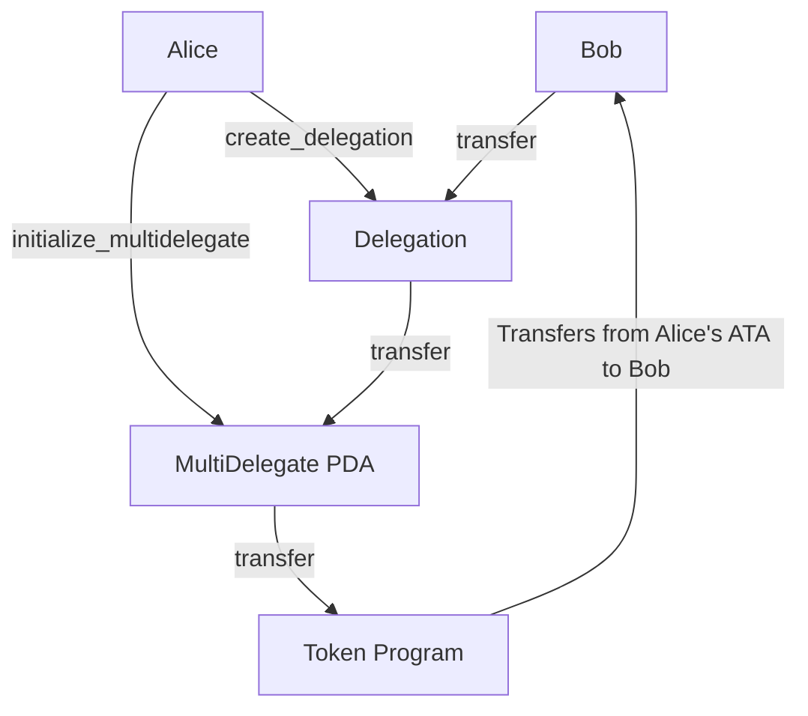
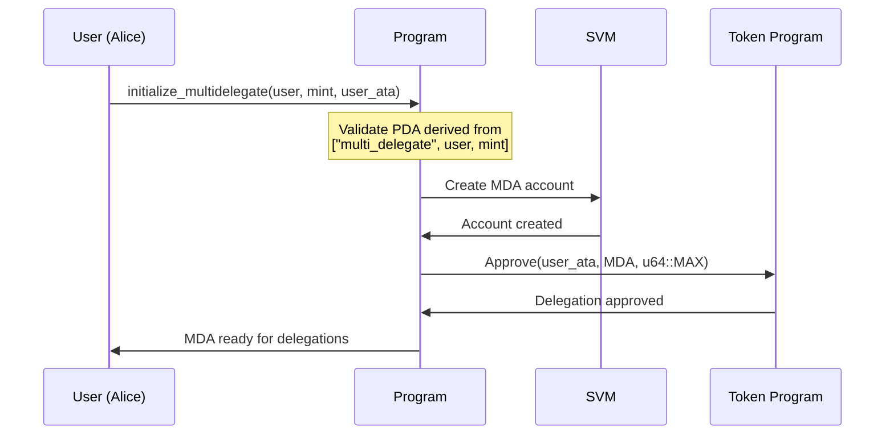
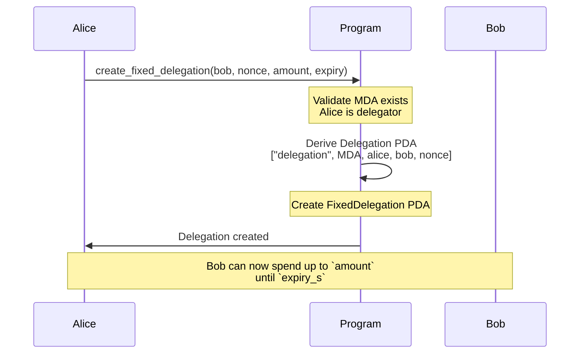
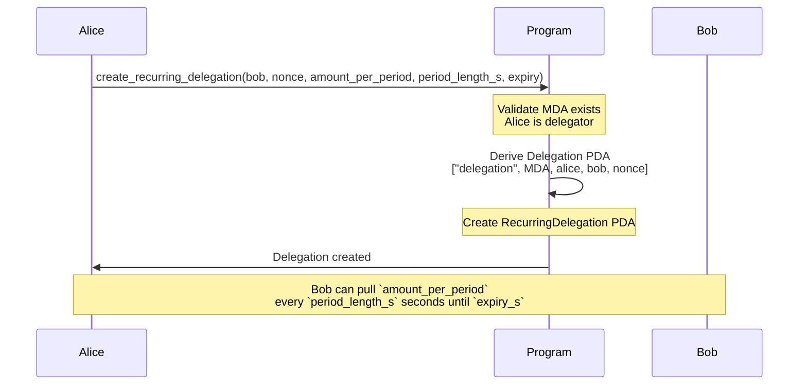
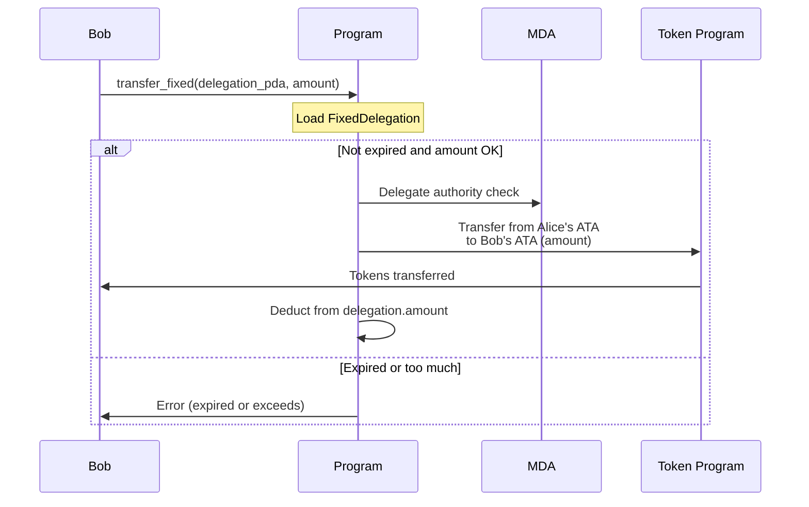
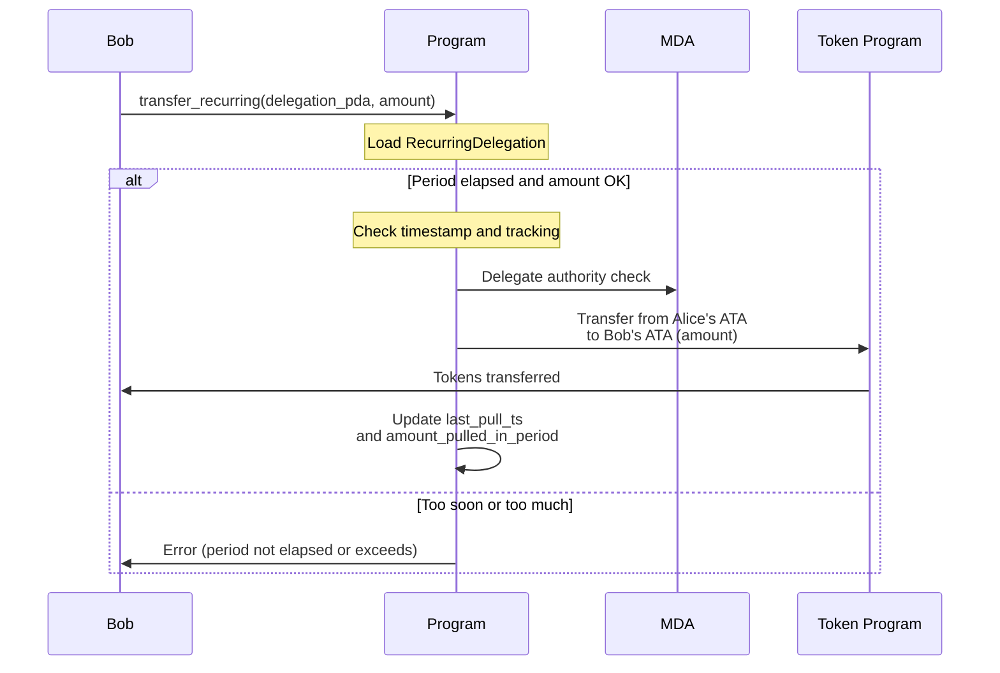

# ADR-001: Multi-Delegator Program Architecture

**Status:** Draft

## Context

Solana's SPL Token delegate model allows only **one delegate per token account**. This creates friction for:

- P2P delegations where users want to authorize friends/services to spend on their behalf
- Multiple simultaneous payment authorizations from a single token account
- Need for controlled, recurring payments with enforceable limits

## Decision

We implement a **single-track delegation model** that provides:

1. **MultiDelegate Authority (MDA)**: A programmatic delegate with unlimited token approval authority (`u64::MAX`) over user token accounts
2. **Delegation PDAs**: Individual constraints governing MDA spending behavior
3. **Delegation Types**: Fixed (one-time with expiry) and Recurring (periodic pulls with limits)
4. **Tech Stack**: Pinocchio framework, Shank for IDL generation, Codama for TypeScript client generation

**Key Design**: MDA receives unlimited approval, but can only transfer when Delegation PDA constraints allow. The program validates constraints before executing transfers, making the system as secure as traditional approval-based delegations while enabling multi-delegation capabilities.

## Architecture Overview

### Fixed Delegation Flow

At a high level, Alice will first create a MultiDelegatePDA which she will give the power to transfer tokens on her behalf.
After this, she will be able to create `Delegations` of different kinds to different users.

Once she creates a Delegation for Bob, he will be able to perform transfers through the program.
The multidelegate program will perform the relevant checks depending on the type of delegation between Alice and Bob.



### Initialization: User Creates MDA



### Fixed Delegation: User Creates for Bob



### Recurring Delegation: User Creates for Bob



### Transfer Execution: Fixed Delegation



### Transfer Execution: Recurring Delegation



---

### MultiDelegate Authority (MDA)

Each user creates one MDA per token mint with seeds `["multi_delegate", user, mint]`. The MDA:

1. Receives `u64::MAX` delegated approval from the user's ATA
2. Acts as the delegate for all transfers from that user's account
3. Cannot transfer on its own - requires active Delegation PDA to authorize

### Delegate Discovery

Delegates discover their delegations via `getProgramAccounts` with `memcmp` filter on the `delegatee` field:

```typescript
// Delegatee discovers Bob's delegations:
getProgramAccounts(PROGRAM_ID, {
  filters: [{ memcmp: { offset: DELEGATEE_OFFSET, bytes: bobPubkey } }],
});
```

## Instructions

### Initialization

| Instruction                | Actor     | Purpose                                              |
| -------------------------- | --------- | ---------------------------------------------------- |
| `initialize_multidelegate` | Delegator | Create MDA and approve `u64::MAX` delegate authority |

### Delegation Creation

| Instruction                   | Actor     | Purpose                                                   |
| ----------------------------- | --------- | --------------------------------------------------------- |
| `create_fixed_delegation`     | Delegator | Create one-time delegation with nonce, amount, and expiry |
| `create_recurring_delegation` | Delegator | Create recurring delegation with period limits            |

---

## Types

```rust
#[repr(u8)]
pub enum DelegationKind {
    Fixed = 0,
    Recurring = 1,
}
```

### MultiDelegate

The MultiDelegate PDA stores the delegator and mint information:

```rust
pub struct MultiDelegate {
    pub user: Pubkey,      // 32 bytes - delegator key
    pub token_mint: Pubkey, // 32 bytes - mint this MDA controls
    pub bump: u8,          // 1 byte
}

impl MultiDelegate {
    pub const SEED: &[u8] = b"multi_delegate";
    pub const LEN: usize = 65;

    pub fn find_pda(user: &Pubkey, token_mint: &Pubkey) -> (Pubkey, u8) {
        find_program_address(
            &[Self::SEED, user.as_ref(), token_mint.as_ref()],
            &crate::ID,
        )
    }
}
```

**PDA seeds**: `["multi_delegate", delegator_key, mint_key]`

### Header

Shared header for all delegation types:

```rust
#[repr(C, packed)]
pub struct Header {
    pub version: u8,      // 1 byte - account format version
    pub kind: u8,          // 1 byte - DelegationKind discriminator
    pub bump: u8,          // 1 byte
    pub delegator: Pubkey, // 32 bytes - user granting delegation
    pub delegatee: Pubkey, // 32 bytes - beneficiary
}

impl Header {
    pub const LEN: usize = 67;
    pub const CURRENT_VERSION: u8 = 1;
    pub const KIND_OFFSET: usize = 1;
}
```

### FixedDelegation

One-time delegation with explicit amount and expiry:

```rust
#[repr(C, packed)]
pub struct FixedDelegation {
    pub header: Header,     // 67 bytes
    pub amount: u64,        // 8 bytes - max pullable amount
    pub expiry_s: u64,      // 8 bytes - Unix timestamp
}

impl FixedDelegation {
    pub const LEN: usize = 83;
}
```

**PDA seeds**: `["delegation", multi_delegate, delegator, delegatee, nonce]`

**Use cases**: One-time payments, time-limited allowances, gift delegations

### RecurringDelegation

Recurring delegation with period tracking:

```rust
#[repr(C, packed)]
pub struct RecurringDelegation {
    pub header: Header,              // 67 bytes
    pub last_pull_ts: i64,           // 8 bytes - last transfer timestamp
    pub period_length_s: u64,         // 8 bytes - seconds per period
    pub expiry_s: u64,                // 8 bytes - delegation expiry
    pub amount_per_period: u64,       // 8 bytes - max per period
    pub amount_pulled_in_period: u64, // 8 bytes - tracking
}

impl RecurringDelegation {
    pub const LEN: usize = 83;
}
```

**PDA seeds**: Same as FixedDelegation

**Use cases**: Subscription payments, recurring allowances, salary-style disbursements

---

## Instruction Details

### `initialize_multidelegate` (Discriminator: 0)

Creates the MDA and grants it `u64::MAX` delegated approval over the user's ATA.

| Account | Type             | Description                 |
| ------- | ---------------- | --------------------------- |
| 0       | signer, writable | The delegator (user)        |
| 1       | writable         | MultiDelegate PDA to create |
| 2       | mint             | Token mint for this MDA     |
| 3       | writable         | User's ATA to approve       |
| 4       | system_program   | System program              |
| 5       | token_program    | Token program               |

**Process:**

1. Validate MDA PDA address derived from `["multi_delegate", user, mint]`
2. Create MDA account with delegator and mint data
3. Call `Approve { source: user_ata, delegate: multi_delegate, authority: user, amount: u64::MAX }`

### `create_fixed_delegation` (Discriminator: 1)

Creates a one-time delegation with nonce-based PDA.

| Account | Type             | Description                            |
| ------- | ---------------- | -------------------------------------- |
| 0       | signer, writable | The delegator creating this delegation |
| 1       | writable         | MultiDelegate PDA for this token type  |
| 2       | writable         | FixedDelegation PDA being created      |
| 3       |                  | The delegatee (beneficiary)            |
| 4       | system_program   | System program                         |

**Parameters:**

- `nonce: u64` - Unique identifier to create distinct PDAs for same (delegator, delegatee) pair
- `amount: u64` - Maximum amount transferable
- `expiry_s: u64` - Unix timestamp when delegation expires

**Process:**

1. Validate MultiDelegate exists and belongs to delegator
2. Derive and validate Delegation PDA from `["delegation", multi_delegate, delegator, delegatee, nonce]`
3. Create Delegation account with header and terms

### `create_recurring_delegation` (Discriminator: 2)

Creates a recurring delegation with period tracking.

| Account | Type             | Description                            |
| ------- | ---------------- | -------------------------------------- |
| 0       | signer, writable | The delegator creating this delegation |
| 1       | writable         | MultiDelegate PDA for this token type  |
| 2       | writable         | RecurringDelegation PDA being created  |
| 3       |                  | The delegatee (beneficiary)            |
| 4       | system_program   | System program                         |

**Parameters:**

- `nonce: u64` - Unique identifier
- `amount_per_period: u64` - Maximum amount per period
- `period_length_s: u64` - Seconds in each period
- `expiry_s: u64` - Delegation expiry timestamp
- `last_pull_ts: i64` - defaults to 0
- `amount_pulled_in_period: u64` - defaults to 0

**Process:**

1. Validate MultiDelegate exists and belongs to delegator
2. Derive and validate Delegation PDA with nonce
3. Create Delegation account with header and terms

---

## Spend/Transfer Design

The transfer mechanism must validate delegation PDA constraints before allowing the MDA to transfer tokens from the delegator's ATA.

### Single `transfer` Instruction

A unified instruction that validates constraints based on delegation kind at runtime.

```rust
pub fn process((data, accounts): (&[u8], &[AccountInfo])) -> ProgramResult {
    // Always delegation has to be the first account

    match accounts.body().first().from_le_bytes() {
        0 => validate_and_execute_fixed_transfer(
            delegation, data, accounts, current_ts
        )?,
        1 => validate_and_execute_recurring_transfer(
            delegation, data, accounts, current_ts
        )?,
        _ => return Err(MultiDelegatorError::InvalidDelegationKind.into()),
    }

    Ok(())
}

fn validate_and_execute_fixed_transfer(
    delegation: &FixedDelegation,
    transfer_data: &vec[u8],
    accounts: &[AccountInfo],
    current_ts: i64,
) -> ProgramResult {
    let accounts = FixedTransferAccounts::try_from(accounts)?;
    let transfer_data = FixedTransferData::load(data)?;

    if current_ts > delegation.expiry_s {
        return Err(MultiDelegatorError::DelegationExpired.into());
    }

    if transfer_data.amount > delegation.amount {
        return Err(MultiDelegatorError::AmountExceedsLimit.into());
    }

    let fixed_delegation = FixedDelegation::load_mut(&mut accounts.delegation_pda.try_borrow_mut_data()?);
    fixed_delegation.amount -= transfer_data.amount;

    let binding = &mut accounts.vault.try_borrow_mut_data()?;
    let vault = Vault::load_mut(binding)?;
    vault.total_pulled_from_delegation += transfer_data.amount;

    // Execute transfer...
    Transfer {
        source: accounts.user_ata,
        destination: accounts.delegatee_ata,
        authority: accounts.multi_delegate,
        amount: transfer_data.amount,
    }.invoke()?;

    Ok(())
}

fn validate_and_execute_recurring_transfer(
    delegation: &RecurringDelegation,
    transfer_data: &vec[u8],
    accounts: &[AccountInfo],
    current_ts: i64,
) -> ProgramResult {
    let accounts = RecurringTransferAccounts::try_from(accounts)?;
    let transfer_data = RecurringTransferData::load(data)?;
    if current_ts > delegation.expiry_s {
        return Err(MultiDelegatorError::DelegationExpired.into());
    }

    let elapsed = current_ts - delegation.last_pull_ts;
    if elapsed < 0 {
        elapsed = 0;
    }

    if elapsed < delegation.period_length_s {
        return Err(MultiDelegatorError::PeriodNotElapsed.into());
    }

    let available = delegation.amount_per_period - delegation.amount_pulled_in_period;
    if transfer_data.amount > available {
        return Err(MultiDelegatorError::AmountExceedsPeriodLimit.into());
    }

    // Update tracking
    let binding = &mut accounts.delegation_pda.try_borrow_mut_data()?;
    let recurring = RecurringDelegation::load_mut(binding)?;
    recurring.last_pull_ts = current_ts;
    recurring.amount_pulled_in_period += transfer_data.amount;

    // Execute transfer...
    Transfer {
        source: accounts.user_ata,
        destination: accounts.delegatee_ata,
        authority: accounts.multi_delegate,
        amount: transfer_data.amount,
    }.invoke()?;

    Ok(())
}
```

---

## Open Questions

1. **Delegator-only vs. Anyone Transfers**: Currently the recurring delegation is designed so that only the delegator can pull the funds. We could open up the type so that it can allow for anyone to run the transfer, but it can only go to a single delegator.

2. **Whitelist of Authorized Callers**: Could it make sense to also have a whitelist of users who can call the transfer function, this can allow for flexibility as to the function of the recurring_delegation.

3. **Whitelist of Authorized Receivers**: Could it make sense to also have a whitelist of users who can receive funds through delegation. For example, to allow for the transfer to only two or three whitelisted addresses? Would we only want to allow for this recurring types, or create a new type of delegation?
