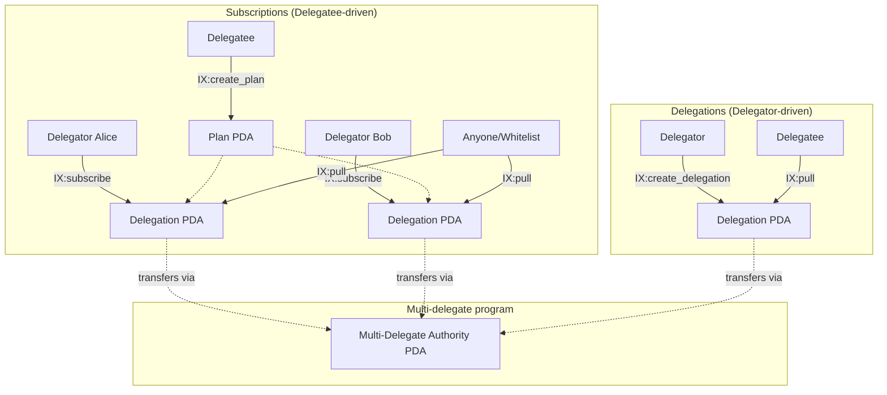
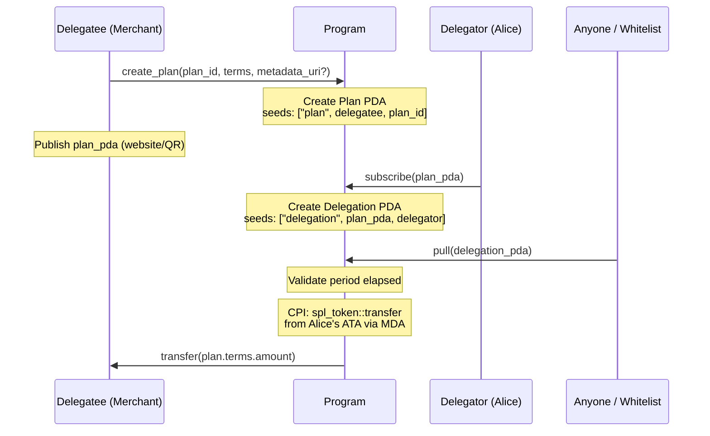
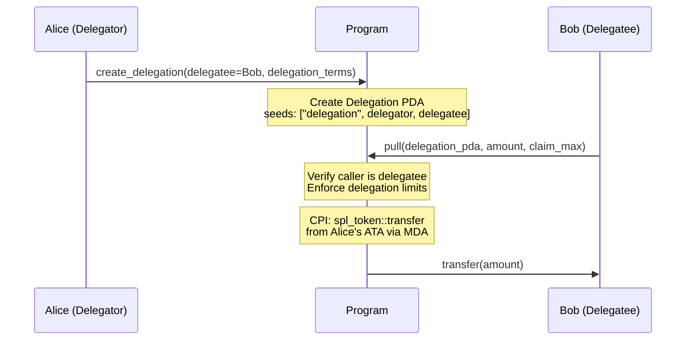
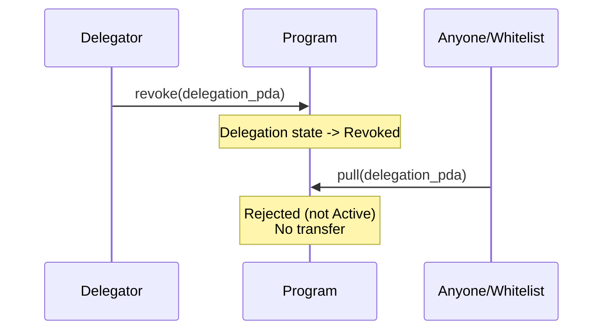
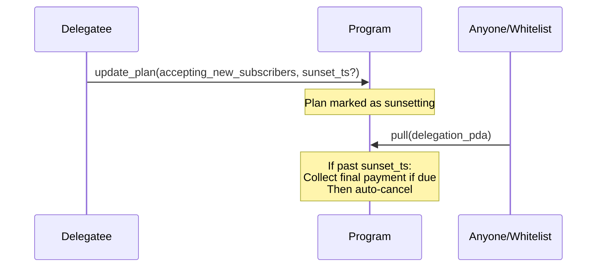
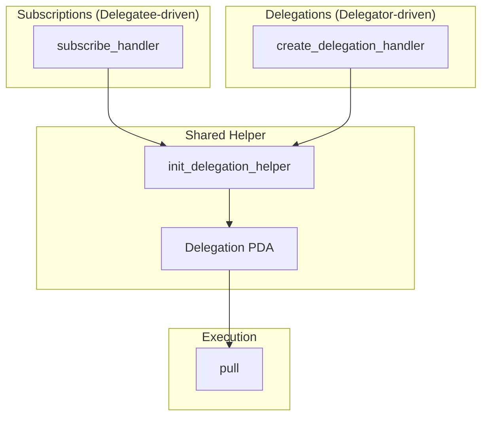

# ADR-001: Multi-Delegator Program Architecture

**Status:** Draft

## Context

Solana's SPL Token delegate model allows only **one delegate per token account**. This creates friction for:
- Subscription payments where merchants need to pull recurring payments
- P2P delegations where users want to authorize friends/services to spend on their behalf
- Multiple simultaneous payment authorizations from a single token account

## Decision

We implement a **dual-track model** that allows:

1. **Subscriptions**: **Delegatee-driven**. The delegatee (merchant) creates a Plan PDA with pre-configured terms; delegators subscribe by creating Delegation PDAs that reference it (one-to-many pattern).
2. **Delegations**: **Delegator-driven**. The delegator creates a Delegation PDA with embedded delegation terms for a specific recipient (one-to-one pattern). No Plan PDA required.
3. **Tech Stack**: Pinocchio framework, Shank for IDL generation, Codama for TypeScript client generation

Notes:
- **Plan PDAs** are reusable accounts containing the terms (e.g., one-time, recurring) which subscriptions act upon.
- **Subscriptions**: An agreement between delegator and delegatee over a shared Plan. The delegatee publishes a Plan PDA containing the Terms (defined by `kind`: Recurring or OneTime); delegators accept by creating a Delegation PDA that references it.
- **Delegations**: A direct grant from delegator to delegatee. The delegator creates a Delegation PDA with embedded Terms (also defined by `kind`); no Plan PDA needed.
- Both tracks use a unified `pull` instruction. Authorization depends on track: Subscriptions check Plan's whitelist (or permissionless), Delegations require the delegatee to pull.

## Architecture Overview



### Delegate Discovery

Delegates (beneficiaries) discover their delegations via `getProgramAccounts` with `memcmp` filter on the `destination` field. This follows Solana ecosystem conventions (SPL Token, OpenBook, Phoenix).

```typescript
// Webapp/SDK discovers Bob's delegations:
getProgramAccounts(PROGRAM_ID, {
  filters: [{ memcmp: { offset: DESTINATION_OFFSET, bytes: bobPubkey } }]
});
```

## Instructions

### Subscriptions (Delegatee-driven)

| Instruction | Actor | Purpose |
|-------------|-------|---------|
| `create_plan` | Delegatee | Create a public Plan PDA with terms |
| `update_plan` | Delegatee | Update plan validity, pull whitelist, set sunset |
| `subscribe` | Delegator | Subscribe to a plan, create Delegation PDA |

### Delegations (Delegator-driven)

| Instruction | Actor | Purpose |
|-------------|-------|---------|
| `create_delegation` | Delegator | Create Delegation PDA with embedded delegation terms |

### Shared

| Instruction | Actor | Purpose |
|-------------|-------|---------|
| `revoke` | Delegator | Cancel subscription or revoke delegation |
| `pull` | Varies | Execute transfer (Subscriptions: anyone or whitelist, Delegations: delegatee only) |

---

## Types

### Zero-Copy Pattern

Pinocchio requires `Pod`/`Zeroable` traits for zero-copy deserialization. Rust enums are incompatible because their discriminants violate `Pod` requirements (must accept any bit pattern).

**Solution:** Discriminator + Payload pattern:

```rust
#[repr(C)]
#[derive(Pod, Zeroable, Clone, Copy)]
pub struct PlanTerms {
    pub kind: u8,              // 0 = Recurring, 1 = OneTime
    pub _padding: [u8; 7],
    pub payload: [u8; 96],     // sized to largest variant (RecurringTerms)
}

pub enum PlanTermsKind<'a> {
    Recurring(&'a RecurringTerms),
    OneTime(&'a OneTimeTerms),
}

impl PlanTerms {
    pub fn try_as_kind(&self) -> Option<PlanTermsKind> {
        match self.kind {
            0 => Some(PlanTermsKind::Recurring(bytemuck::from_bytes(&self.payload[..96]))),
            1 => Some(PlanTermsKind::OneTime(bytemuck::from_bytes(&self.payload[..72]))),
            _ => None,
        }
    }
}
```

### `PlanTerms` Variants

Each `kind` maps to a well-typed struct:

```rust
#[repr(C)]
#[derive(Pod, Zeroable, Clone, Copy)]
pub struct RecurringTerms {
    pub mint: Pubkey,           // 32 bytes
    pub destination: Pubkey,    // 32 bytes
    pub amount_per_period: u64, // 8 bytes
    pub period_secs: u64,       // 8 bytes
    pub start_ts: u64,          // 8 bytes
    pub end_ts: u64,            // 8 bytes
}                               // Total: 96 bytes

#[repr(C)]
#[derive(Pod, Zeroable, Clone, Copy)]
pub struct OneTimeTerms {
    pub mint: Pubkey,           // 32 bytes
    pub destination: Pubkey,    // 32 bytes
    pub amount: u64,            // 8 bytes
}                               // Total: 72 bytes
```

| Kind | Value | Struct |
|------|-------|--------|
| Recurring | 0 | `RecurringTerms` |
| OneTime | 1 | `OneTimeTerms` |

> **Note:** `DelegationTerms` is a type alias for `PlanTerms`. Both use the same structure; the naming reflects usage context (Plan-based subscriptions vs direct delegations).

### Plan PDA

The Plan account stores terms, ownership, and pull permissions:

```rust
#[repr(C)]
#[derive(Pod, Zeroable, Clone, Copy)]
pub struct Plan {
    pub owner: Pubkey,                 // 32 bytes - Plan creator
    pub plan_id: u64,                  // 8 bytes - Unique identifier
    pub terms: PlanTerms,              // 104 bytes - Payment terms
    pub accepting_new_subscribers: u8, // 1 byte - Can new users subscribe?
    pub use_pull_whitelist: u8,       // 1 byte - Enable whitelist for pull?
    pub _padding: [u8; 6],             // 6 bytes - Alignment
    pub sunset_ts: u64,                // 8 bytes - No renewals after this
    pub pull_whitelist: [Pubkey; 4],  // 128 bytes - Allowed pullers
    pub metadata_uri: [u8; 128],       // 128 bytes - Optional metadata
}                                      // Total: ~423 bytes
```

**Pull permissions logic:**
- If `use_pull_whitelist == 0`: anyone can call `pull` (permissionless)
- If `use_pull_whitelist == 1`: only `owner` or addresses in `pull_whitelist` can call `pull`

### Delegation PDA

The Delegation account represents an active delegation. Used by both tracks with different field usage:

```rust
#[repr(C)]
#[derive(Pod, Zeroable, Clone, Copy)]
pub struct Delegation {
    pub flags: u8,                        // bit0: is_direct_delegation
    pub bump: u8,
    pub _reserved: [u8; 6],
    pub delegator: Pubkey,                // 32 bytes - The user granting the delegation
    pub plan_pda: Pubkey,                 // 32 bytes - Subscriptions: valid, Delegations: default
    pub delegation_terms: DelegationTerms, // 104 bytes - Delegations only (zeroed for Subscriptions)
    pub state: u8,                        // 1 byte - Active/Cancelled/Revoked
    pub _padding2: [u8; 7],
    pub period_pulled: u64,               // 8 bytes - Tracking
    pub total_pulled: u64,                // 8 bytes - Tracking
    pub last_pull_ts: u64,                // 8 bytes - Tracking
}
```

**Field usage by track:**

| Field | Subscriptions | Delegations |
|-------|---------------|-------------|
| `plan_pda` | Valid (references Plan) | `Pubkey::default()` |
| `delegation_terms` | Zeroed (use Plan.terms) | Embedded terms |

**PDA seeds by track:**
- **Subscriptions**: `["delegation", plan_pda, delegator]` - keyed by Plan to prevent duplicate subscriptions
- **Delegations**: `["delegation", delegator, delegatee]` - keyed by parties to prevent duplicate delegations

---

## Instruction Details

### Subscriptions (Delegatee-driven)

- **IX: `create_plan`**

  Delegatee creates a public plan PDA (reusable by many delegators).

  | Parameter | Type | Description |
  |------|------|-------------|
  | `plan_id` | u64 | Unique identifier for the plan |
  | `terms` | PlanTerms | Plan terms (see Types section) |
  | `metadata_uri` | String? | Optional metadata URI |

- **IX: `update_plan`**

  Delegatee updates plan validity and pull permissions.

  | Parameter | Type | Description |
  |------|------|-------------|
  | `accepting_new_subscribers` | bool? | Whether new delegators can subscribe |
  | `sunset_ts` | u64? | No renewals after this timestamp |
  | `use_pull_whitelist` | bool? | Enable/disable pull whitelist |
  | `pull_whitelist` | [Pubkey; 4]? | Addresses allowed to pull (in addition to owner) |

- **IX: `subscribe`**

  Delegator subscribes to a specific plan PDA; creates a per-user Delegation PDA.

  | Parameter | Type | Description |
  |------|------|-------------|
  | `plan_pda` | Pubkey | Plan to subscribe to |

### Delegations (Delegator-driven)

- **IX: `create_delegation`**

  Delegator creates a Delegation PDA with embedded delegation terms.

  | Parameter | Type | Description |
  |------|------|-------------|
  | `delegatee` | Pubkey | Destination for pulled funds |
  | `delegation_terms` | DelegationTerms | Delegation terms (embedded in Delegation) |

### Shared

- **IX: `revoke`**

  Delegator cancels subscription or revokes allowance (immediate stop of future pulls).

  | Parameter | Type | Description |
  |------|------|-------------|
  | `delegation_pda` | Pubkey | Delegation to revoke |

- **IX: `pull`**

  Unified pull instruction for both tracks. Executes transfer according to Delegation terms.

  | Parameter | Type | Description |
  |------|------|-------------|
  | `delegation_pda` | Pubkey | Delegation to pull from |
  | `amount` | u64? | Amount to pull (optional for recurring terms) |
  | `claim_max` | bool | If true, pull max available |

  **Authorization logic:**
  - **Subscriptions**: Check `Plan.use_pull_whitelist`; if true, caller must be in `Plan.pull_whitelist`; if false, anyone can call `pull`
  - **Delegations**: Only the delegatee can call `pull`

---

## Sequence Diagrams

### Subscription: Delegatee Creates Plan, Delegator Subscribes



> **Note:** The destination address (recipient of funds) is specified in `terms.destination` and can differ from the Plan owner.

### Delegation: Delegator Creates Delegation for Bob



### Delegator Revokes Delegation



### Subscription: Delegatee Sunsets Plan



---

## Delegation Modes handlers

Both handlers use a shared `init_delegation_helper` to initialize the **Delegation PDA**.



## Security Model

| Attack | Prevention |
|--------|------------|
| Delegator modifies subscription terms | Can't, must reference existing Plan PDA |
| Delegatee changes price mid-subscription | `update_plan` cannot modify terms (only metadata/whitelist) |
| Delegatee force-cancels delegator | Only delegator can call `revoke` |
| Delegatee exceeds limits | Delegation tracks period_pulled, total_pulled |
| Double-pull in same period | Period tracking with reset logic |
| Pull after expiry | end_ts check |
| Unauthorized pull | Subscriptions: whitelist check; Delegations: delegatee-only check |
| Delegation hijacking via `subscribe` | Impossible, Delegations have no Plan PDA |
| Orphaned MDA delegation | Harmless; transfers require valid Delegation state |

---

## Consequences

### Positive
- `+` **Unified Delegation PDA** - single account type for both Subscriptions and Delegations
- `+` **Unified pull instruction** - single `pull` simplifies interface
- `+` **Immutable terms** - `update_plan` cannot modify terms (amount, period, destination)
- `+` **Configurable pull permissions** - Subscriptions: permissionless or whitelist; Delegations: delegatee-only
- `+` **Sunset mechanism** - graceful plan discontinuation
- `+` **Code reuse** - shared `init_delegation_helper`
- `+` **Zero-copy performance** - Pinocchio with Pod/Zeroable
- `+` **Reusable Plans** - one Plan serves many delegators
- `+` **Immediate cancellation** - delegators can stop anytime
- `+` **Delegations immune to hijacking** - no Plan PDA to subscribe on

### Negative
- `-` Two instruction paths to maintain (Subscriptions + Delegations)
- `-` PlanTerms payload sized for largest variant
- `-` Delegation PDAs larger when using embedded terms

### Neutral
- `~` Plan rent paid by delegatee (Subscriptions only)
- `~` Delegation rent paid by delegator
- `~` MDA gets unlimited approval (u64::MAX) - necessary for pattern but requires trust in program
