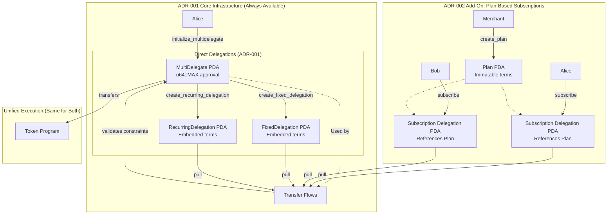
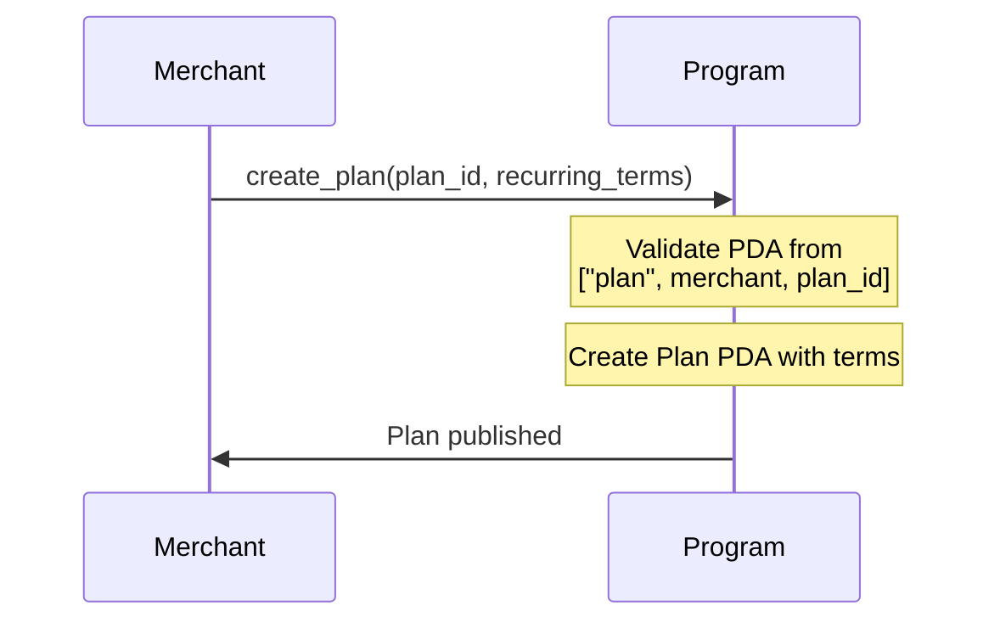
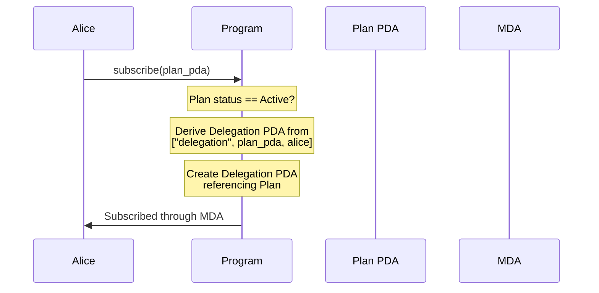
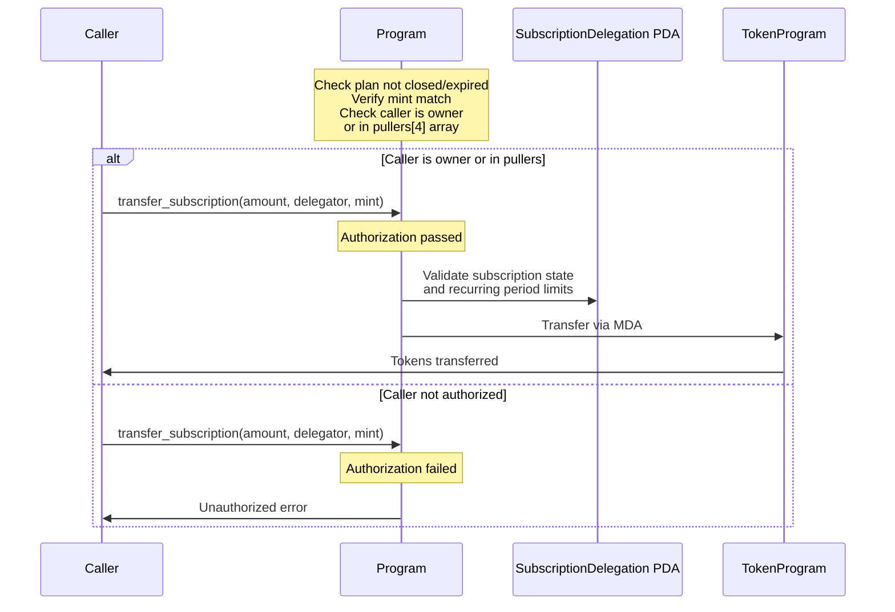
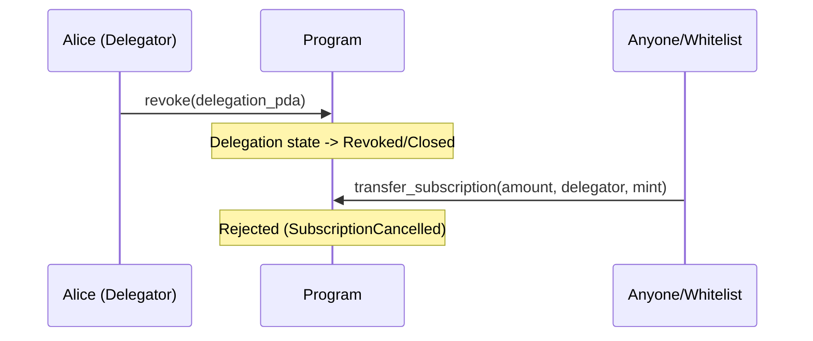
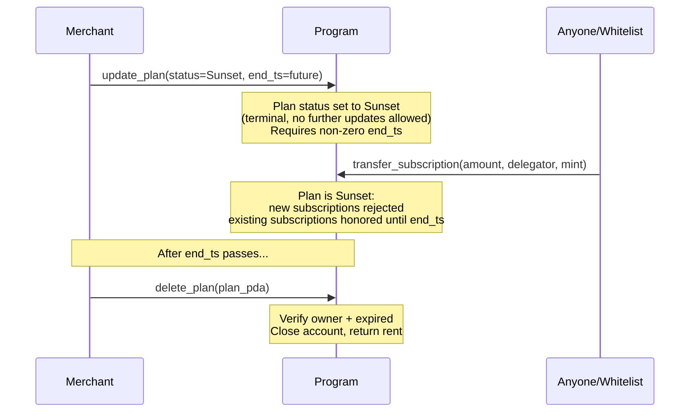

# ADR-002: Multi-Delegator Subscriptions (Plan Track)

**Status:** Draft

**Parent ADR:** ADR-001 - Multi-Delegator Program Architecture

## Context

ADR-001 implements a direct delegation model where delegators create Delegation PDAs with embedded terms for each delegatee. This works well for P2P, one-off, and bespoke delegations. However, subscription-based services and mass-market scenarios benefit from an additional pattern where:

**Both parties agree to terms in advance** - The merchant publishes immutable terms, subscribers verify and accept them.

**Use Cases:**

1. **Subscription Services**: Netflix, Spotify, or any SaaS where:
   - Merchants publish pricing plans once for all customers
   - Many users voluntarily subscribe to the same pre-verified terms
   - Terms remain immutable to establish trust

2. **Recurring Billing Platforms**: Payment processors where:
   - Merchants want centralized plan management
   - Subscribers independently verify terms before subscribing
   - Mutual agreement on pricing prevents disputes

3. **Marketplace Ecosystems**: DeFi or NFT platforms where:
   - Service providers publish standardized offerings
   - Users discover and subscribe via UI/SDK with term verification
   - Plan registries enable discoverability

**This is an Enhancement, Not Replacement:**
- ADR-001 flows remain fully available and intact
- Plans are built on top of the existing delegation structure
- Both models can coexist and are selected per use case
- Delegators always maintain their direct delegation capabilities

## Decision

Extend ADR-001 with a **Plan-based subscription layer** that:
1. Allows delegatees to publish reusable, immutable terms as Plans
2. Lets delegators subscribe to Plans, creating Delegation PDAs that reference the Plan
3. Uses the same MultiDelegate Authority (MDA) and transfer flows from ADR-001
4. Adds mutual agreement verification: delegators verify Plan terms before subscribing

### Architecture Overview

ADR-002 is an **add-on** to ADR-001 that introduces Plans while reusing all existing delegation infrastructure:



**Key Design Principles:**

1. **Add-On, Not Replacement**: ADR-002 extends ADR-001 without modifying core flows
2. **Mutual Agreement**: Plans enable both parties to verify and agree on terms before commitment
3. **Immutable Terms**: Once published, Plan terms cannot change (prevents mid-stream price hikes)
4. **Separate Controls vs Terms**: `update_plan` can modify status, end_ts, metadata_uri - but NOT core terms (mint, amount, period_hours, destinations, pullers)
5. **Unified Execution**: Subscriptions and direct delegations share the same MDA and transfer flows
6. **Coexistence**: Direct delegations (ADR-001) and subscriptions (ADR-002) operate simultaneously

### Rationale

**Why Add Plans to ADR-001?**

ADR-001 provides the core delegation infrastructure. Plans add a subscription model on top with these benefits:

1. **Mutual Term Agreement**
   - Both delegator and delegatee verify the same immutable Plan terms
   - Establishes clear, shared understanding before commitment
   - Prevents disputes - terms are visible to all parties

2. **Cost Efficiency for Merchants (Delegatees)**
   - One Plan PDA serves infinite subscribers
   - Per-subscriber cost is only the Delegation PDA (much smaller than Plan)
   - Example: 10K subscribers = 10K Delegation PDAs + 1 Plan (vs 10K separate delegations if using embedded terms

3. **Trust Model Through Immutability**
   - Merchants commit to terms via immutable Plan
   - Subscribers verify Plan terms before subscribing
   - No fear of arbitrary price changes mid-subscription
   - Builds trust for subscription-heavy use cases

4. **Discoverability and Ecosystem Growth**
   - Merchants publish Plans with metadata URIs (images, descriptions)
   - Plan discovery via `getProgramAccounts` and filtering
   - Enables subscription marketplaces and aggregators
   - Supports frontend SDKs for user-friendly subscription flows

5. **Management Flexibility**
   - `update_plan` allows:
      - Set status to Sunset (stop accepting new subscribers, terminal and irreversible, requires non-zero end_ts)
      - Set end_ts (graceful discontinuation, or 0 to remove expiry; cannot be 0 when sunsetting)
      - Update metadata_uri (change plan description/branding)
   - Without modifying core terms (mint, amount, period_hours, destinations, pullers)
   - `delete_plan` allows the owner to reclaim rent after a plan has expired (end_ts has passed)

6. **Zero Breaking Changes to ADR-001**
   - All direct delegation flows continue working unchanged
   - Transfer logic is reused with Plan-provided terms instead of embedded terms
   - `pullers` array configures authorization without modifying core transfer validation
   - Both models use the same MultiDelegate PDA infrastructure

7. **Opt-In Enhancement**
   - Use ADR-001 for: P2P, ad-hoc, customized delegations
   - Use ADR-002 for: Subscriptions, mass-market, standardized services
   - Users choose the approach that fits their use case

### Comparison to Direct Delegation

| Aspect | ADR-001 Direct Delegation | ADR-002 Plan Subscriptions |
|--------|------------------------|---------------------------|
| **Creation** | Delegator initiates | Delegatee publishes, delegators subscribe |
| **Terms Storage** | Embedded per delegation | Single Plan for all |
| **Cost Structure** | Full cost per delegation | Plan cost (1x) + Delegation cost (Nx) |
| **Term Mutability** | Per delegation | None (immutable after creation) |
| **Discoverability** | Manual PDA sharing | Plans can be discovered/marketplace |
| **Use Cases** | P2P, custom, one-off | Subscription services, SaaS, platforms |
| **Pull Authorization** | Delegatee-only (`transfer_fixed`/`transfer_recurring`) | Owner + configurable pullers array (`transfer_subscription`) |
| **Cancellability** | Not implemented (add later) | Delegator can revoke, Plan can sunset |

### Integration With ADR-001

ADR-002 is built **on top of** ADR-001's core infrastructure with **zero changes to existing flows**:

**Key Insight: Terms are Copied, Not Referenced**

The Plan serves as a **source of truth** for terms. When a delegator subscribes, the Plan's terms are **copied to the Delegation PDA** at creation time. This means:

| Flow | Terms Source | Result |
|------|-------------|--------|
| **Direct Delegation (ADR-001)** | User provides terms directly → | Copied to Delegation PDA |
| **Subscription (ADR-002)** | Plan contains terms → | Copied to Delegation PDA at subscribe |

**All Transfer Validation Logic Stays Identical:**
- `transfer_fixed` always reads `FixedDelegation.amount` and `expiry_s` from Delegation PDA
- `transfer_recurring` always reads period and tracking from Delegation PDA
- No changes needed - terms are always in the Delegation PDA, the same validation applies

**What Plans Add:**
1. **Publishable Terms:** Merchants publish Plans with immutable terms
2. **Verification:** Delegators can verify Plan terms before subscribing
3. **Copy on Subscribe:** When subscribing, Plan terms are copied to the new Delegation PDA
4. **Mutual Agreement:** Both parties see and agree to the same terms before delegation creation

**The Plan is Just a Template:**
- Plan = Published, reusable terms that delegators can subscribe to
- Subscribe = Create a Delegation PDA with a copy of the Plan's terms
- After subscription, the Delegation is self-contained and works exactly like ADR-001 delegations

**No Breaking Changes:**
- All ADR-001 instructions work unchanged
- Transfer validation code is identical for both models
- The `subscribe` instruction is the only new logic: it copies terms from Plan to Delegation

**Component Reuse:**

| Component | ADR-001 | ADR-002 |
|-----------|---------|---------|
| `MultiDelegate` PDA | ✓ Used | ✓ Same MDA |
| `FixedDelegation` structure | ✓ Embedded terms | ✓ Embedded terms (copied from Plan) |
| `RecurringDelegation` structure | ✓ Embedded terms | ✓ Embedded terms (copied from Plan) |
| `transfer_fixed` instruction | ✓ Reads from Delegation | ✓ Reads from Delegation (same) |
| `transfer_recurring` instruction | ✓ Reads from Delegation | ✓ Reads from Delegation (same) |
| **NEW** | - | `Plan` PDA (source of terms) |
| **NEW** | - | `subscribe` instruction (creates SubscriptionDelegation) |
| **NEW** | - | `transfer_subscription` instruction (pull with Plan validation) |

**Seeded Separation for Coexistence:**
- **Direct Delegations**: Seeds `["delegation", multi_delegate, delegator, delegatee, nonce]`
- **Subscription Delegations**: Seeds `["delegation", plan_pda, delegator]`
- Different seeds prevent PDA collisions
- Both can use the same MultiDelegate PDA simultaneously
- Both models can be used in the same program instance

**Example: How Terms Flows**

**ADR-001 Direct Delegation:**
- Alice provides terms directly to `create_fixed_delegation`
- Terms are written to the Delegation PDA
- Transfer validation reads these same fields later

**ADR-002 Subscription:**
- Plan contains terms (amount=1000, expiry=...)
- `subscribe` reads Plan terms and copies them to the Delegation PDA
- Result: Delegation is self-contained, same as ADR-001

**Transfer is identical for both:**
- `transfer_fixed` reads delegation.amount and delegation.expiry_s
- Works the same whether created via ADR-001 or ADR-002

**Flows Remain Available:**
- All ADR-001 instructions (`initialize_multidelegate`, `create_fixed_delegation`, `create_recurring_delegation`) continue to work unchanged
- New ADR-002 instructions (`create_plan`, `update_plan`, `delete_plan`, `subscribe`, `transfer_subscription`) add subscription capability
- Direct delegations and subscriptions can be created and withdrawn independently
- Transfer validation code is shared and identical for both models

---

## Types

### Plan PDA (`repr(C, packed)`)

Top-level account structure:
- `discriminator`: 1 byte - `AccountDiscriminator::Plan` (= 1)
- `owner`: 32 bytes - Merchant (Plan creator)
- `bump`: 1 byte - PDA bump seed
- `status`: 1 byte - `PlanStatus` enum (Sunset=0, Active=1)
- `data`: PlanData (see below)

### PlanData (448 bytes)

Embedded payload within the Plan PDA:
- `plan_id`: 8 bytes (`u64`) - Unique identifier
- `mint`: 32 bytes (`Address`) - Token mint
- `amount`: 8 bytes (`u64`) - Amount per period
- `period_hours`: 8 bytes (`u64`) - Hours in each billing period
- `end_ts`: 8 bytes (`i64`) - Plan expiration timestamp (0 = no expiry)
- `destinations`: 128 bytes (`[Address; 4]`) - Up to 4 fund recipients (all zeros = any destination valid at transfer time)
- `pullers`: 128 bytes (`[Address; 4]`) - Up to 4 authorized pullers
- `metadata_uri`: 128 bytes (`[u8; 128]`) - Optional metadata URI

Plans are always recurring; there is no one-time variant.

**PDA seeds**: `["plan", merchant, plan_id]`

**Puller Authorization:**
- The plan owner is **always** implicitly authorized to pull (does not need to be in the `pullers` array)
- If all 4 puller slots are zero, only the plan owner can pull
- Up to 4 additional puller addresses can be specified in the `pullers` array
- Zero-filled entries are ignored

**Destination Whitelist:**

The `destinations` array controls where pulled funds can be sent. If the array is empty (all zeros), funds can be transferred to any wallet. If any addresses are set, the receiver must match one of them (else `UnauthorizedDestination`). Destinations are immutable after plan creation.

---

## Instructions

### `create_plan` (Discriminator: 7)

Merchant publishes a Plan with subscription terms.

| Account | Type              | Description          |
| ------- | ----------------- | -------------------- |
| 0       | signer, writable  | Merchant (Plan owner)|
| 1       | writable          | Plan PDA to create   |
| 2       | system_program    | System program       |

**Parameters (PlanData):**
- `plan_id: u64` - Unique identifier
- `mint: Address` - Token mint
- `amount: u64` - Amount per period
- `period_hours: u64` - Hours per billing period
- `end_ts: i64` - Plan expiration (0 = no expiry)
- `destinations: [Address; 4]` - Fund recipients, optional (all zeros = any destination valid at transfer time)
- `pullers: [Address; 4]` - Authorized pullers (optional, plan owner always authorized by default)
- `metadata_uri: [u8; 128]` - Optional metadata URI

**Validation:**
1. `amount > 0` (else `InvalidAmount`)
2. `0 < period_hours <= 8760` (else `InvalidPeriodLength`)
3. `end_ts == 0` or `end_ts > current_time` (else `InvalidEndTs`)

**Process:**
1. Validate PlanData fields (see above)
2. Derive PDA from `["plan", merchant, plan_id]` and verify match (else `InvalidPlanPda`)
3. Create Plan account via CPI to System Program (handles pre-funded accounts)
4. Set `discriminator = Plan (1)`, `owner = merchant`, `bump`, `status = Active (1)`
5. Copy PlanData into the account

### `update_plan` (Discriminator: 8)

Plan owner updates mutable admin fields (status, end_ts, metadata_uri). Core terms (mint, amount, period_hours, destinations, pullers, plan_id) are immutable.

| Account | Type     | Description        |
| ------- | -------- | ------------------ |
| 0       | signer   | Plan owner         |
| 1       | writable | Plan PDA to update |

**Parameters (UpdatePlanData, 137 bytes):**
- `status: u8` - PlanStatus (Sunset=0, Active=1)
- `end_ts: i64` - Plan expiration timestamp (0 = remove expiry, cannot be 0 when status=Sunset)
- `metadata_uri: [u8; 128]` - Metadata URI

**Process:**
1. Load Plan account, verify discriminator and size
2. Verify caller is Plan owner (else `NotPlanOwner`)
3. Reject if plan is already in Sunset status (else `PlanImmutableAfterSunset`) - Sunset is a terminal state
4. Reject if status=Sunset and end_ts=0 (else `SunsetRequiresEndTs`) - sunsetting requires a finite expiration
5. Validate input data: `PlanStatus::try_from(status)` must succeed (else `InvalidPlanStatus`), `end_ts == 0` or `end_ts > current_time` (else `InvalidEndTs`)
6. Reject if plan has expired: `plan.end_ts != 0 && current_ts > plan.end_ts` (else `PlanExpired`)
7. Write status, end_ts, and metadata_uri from input data

**Immutable fields (never modified by update_plan):**
`plan_id`, `owner`, `bump`, `mint`, `amount`, `period_hours`, `destinations`, `pullers`

### `delete_plan` (Discriminator: 9)

Plan owner deletes an expired plan, closing the account and reclaiming rent. Does NOT require Sunset status, only that the plan has expired.

| Account | Type             | Description                              |
| ------- | ---------------- | ---------------------------------------- |
| 0       | signer, writable | Plan owner (receives rent)               |
| 1       | writable         | Plan PDA to delete                       |

**Parameters:** None (only discriminator byte)

**Process:**
1. Verify caller is Plan owner (else `NotPlanOwner`)
2. Verify plan is expired: `end_ts != 0 && current_ts > end_ts` (else `PlanNotExpired`)
3. Close account: zero all data, transfer lamports to owner

**Lifecycle paths to deletion:**
- **Active + expired:** Plan created with end_ts, time passes, owner deletes. Natural lifecycle.
- **Sunset + expired:** Owner sunsets plan (sets end_ts), time passes, owner deletes. Early termination.
- **Perpetual plans (end_ts=0):** Cannot be deleted directly. Owner must first `update_plan` to set an end_ts, then wait for expiration.

### `subscribe` (Discriminator: 5)

Delegator subscribes to a Plan, **copying the Plan's terms to a new Delegation PDA**.

| Account | Type | Description |
|---------|------|-------------|
| 0 | signer | Delegator |
| 1 | | Plan PDA being subscribed to |
| 2 | writable | Delegation PDA to create (copy of Plan terms) |
| 3 | writable | MultiDelegate PDA (from ADR-001) |
| 4 | system_program | System program |

**Parameters:** None (terms come from Plan and are copied to Delegation)

**Process:**
1. Validate Plan exists and `status == Active (1)`
2. Derive Delegation PDA from `["delegation", plan_pda, delegator]`
3. **Create Delegation with terms copied from Plan:**
   - Copy `header.kind`, `header.delegatee` from Plan.terms
   - Copy delegation-specific terms (amount, expiry_s, etc.) from Plan.terms
   - Result: Delegation PDA is self-contained, identical structure to ADR-001 delegations
4. Delegation no longer references Plan - it's independent and uses same validation as direct delegations

**Key Point:** After subscription, the Delegation PDA is self-contained. The Plan is just a template that got copied. This means all transfer validation logic remains identical to ADR-001.

---

### `transfer_subscription` (Discriminator: 10)

Authorized caller (plan owner or whitelisted puller) pulls tokens from a subscriber's account through their SubscriptionDelegation, validated against the Plan's terms.

| Account | Type             | Description                                      |
| ------- | ---------------- | ------------------------------------------------ |
| 0       | writable         | SubscriptionDelegation PDA                       |
| 1       |                  | Plan PDA                                         |
| 2       |                  | MultiDelegate PDA                                |
| 3       | writable         | Delegator's ATA (source of funds)                |
| 4       | writable         | Receiver's ATA (destination)                     |
| 5       | signer           | Caller (plan owner or whitelisted puller)         |
| 6       |                  | Token program                                    |

**Parameters (TransferData):**
- `amount: u64` - Amount to transfer
- `delegator: Address` - Subscriber's public key
- `mint: Address` - Token mint

**Validation:**
1. Verify plan account is program-owned (else `PlanClosed`)
2. Load Plan and verify `mint` matches `transfer_data.mint` (else `MintMismatch`)
3. Check plan not expired: `end_ts == 0` or `current_ts <= end_ts` (else `PlanExpired`)
4. Authorize caller: must be plan owner or listed in `pullers` array (else `Unauthorized`)
5. Validate destination: if plan has non-zero destinations, receiver ATA owner must match one (else `UnauthorizedDestination`); if all destinations are zero, any receiver is valid
6. Load SubscriptionDelegation and verify `delegatee == plan_pda` (else `SubscriptionPlanMismatch`)
7. Verify `delegator` matches `transfer_data.delegator` (else `Unauthorized`)
8. Check subscription not cancelled: `revoked_ts == 0` or `current_ts <= revoked_ts` (else `SubscriptionCancelled`)
9. Validate recurring transfer: amount within period limit, handle period rollover
10. Update subscription state (`current_period_start_ts`, `amount_pulled_in_period`)
11. Execute transfer via MultiDelegate PDA (CPI to Token Program)

**Authorization Logic:**
- Direct delegations (ADR-001): Only delegatee can call transfer
- Subscription delegations (ADR-002): Plan owner is always authorized, plus up to 4 additional addresses in `pullers` array

**Sunset behavior:** A plan in Sunset status still allows existing subscription pulls. Sunset only prevents new subscriptions (handled in `subscribe` instruction).

---

## Sequence Diagrams

### Merchant Creates Plan



### Alice Subscribes



### Transfer Subscription (Pull)



### Delegator Revokes Subscription



### Merchant Sunsets and Deletes Plan



---

## Security Model

| Attack | Prevention |
|--------|------------|
| Merchant changes terms mid-subscription | `update_plan` only modifies status, end_ts, metadata_uri; core terms (mint, amount, period_hours, destinations, pullers) are immutable |
| Delegator can't verify terms | Terms stored in immutable Plan PDA; delegator verifies before subscribing |
| Unauthorized pull on Plans | Owner is always authorized, plus explicit pullers array (`Unauthorized`) |
| Plan closed/deleted before pull | `transfer_subscription` checks plan ownership before loading; returns `PlanClosed` if account is no longer program-owned |
| Puller redirects funds to unauthorized wallet | `destinations` whitelist is checked at transfer time; receiver ATA owner must match a whitelisted address (`UnauthorizedDestination`). Destinations are immutable after plan creation. |
| Delegator hijacks subscription | Delegation PDA seeds include plan_pda; can't be recreated |
| Plan expiration handling | `end_ts` field; 0 means no expiry, otherwise must be in the future at creation. Sunset requires non-zero end_ts (`SunsetRequiresEndTs`) |
| Unauthorized plan deletion | `delete_plan` requires owner signature and expired end_ts (`PlanNotExpired`). Does not require Sunset status. |
| Plan with invalid data | Validated: amount>0, period_hours in (0,8760], destinations optional (0-4), end_ts=0 or future |
| Orphaned Delegation reference | Delegation tracks state; `transfer_subscription` checks Plan reference |
| MDA spends without Plan constraint | Pull must validate Plan terms and Delegation constraints |

---

## Consequences

### Positive
- `+` **Cost Efficiency** - One Plan serves many subscribers
- `+` **Trust Through Immutability** - Terms fixed at creation prevent price changes
- `+` **Discoverability** - Plans can be published and discovered via marketplaces
- `+` **Flexible Control** - Pullers array for authorization, status and end_ts for lifecycle
- `+` **Reuses ADR-001** - Shares MDA infrastructure, minimal code duplication
- `+` **Complementary** - Subscriptions and direct delegations can coexist
- `+` **Marketplace Enabling** - Standard structure for subscription services

### Negative
- `-` **Complexity** - Adds Plan management layer and additional instructions
- `-` **Rent Overhead** - Plan rent paid by merchants (though amortized over many delegations)
- `-` **Discovery Required** - Delegators must find Plans (vs direct PDA sharing)

### Neutral
- `~` **Mixed Authorization Models** - Direct delegations: delegatee-only; Subscriptions: configurable
- `~` **Shared Execution** - Can reuse transfer logic from ADR-001 or adapt to Plan terms
- `~` **Graceful Sunset** - Allows merchants to retire plans while honoring existing commitments

---

## Migration Path (If Needed)

Subscription Delegations would use different PDA seeds than direct delegations, so both models can coexist:

**Direct Delegation Seeds (ADR-001):**
```
["delegation", multi_delegate, delegator, delegatee, nonce]
```

**Subscription Delegation Seeds (ADR-002):**
```
["delegation", plan_pda, delegator]
```

This enables incremental rollout (start with direct, add subscriptions later) without breaking existing delegations.

---

## Future Enhancements

- Plan marketplace/aggregator protocol for discovery
- Merkle tree for pullers (scale beyond 4 addresses)
- Event logs for subscription lifecycle (subscribe, renew, expire)
- Subscription UI/SDK templates for frontend
- Analytics for merchants (active subscribers, total volume)
- Auto-renewal with Plan term modifications (version upgrades)