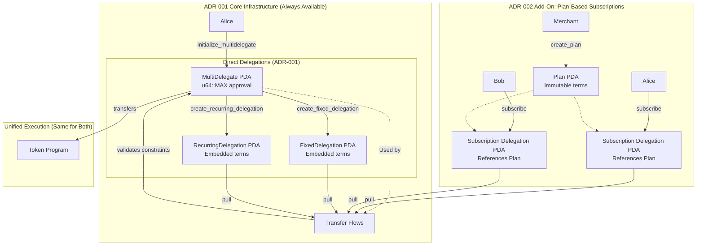
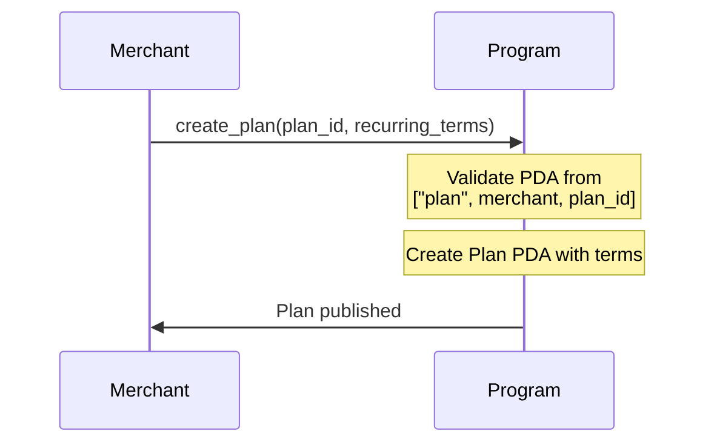
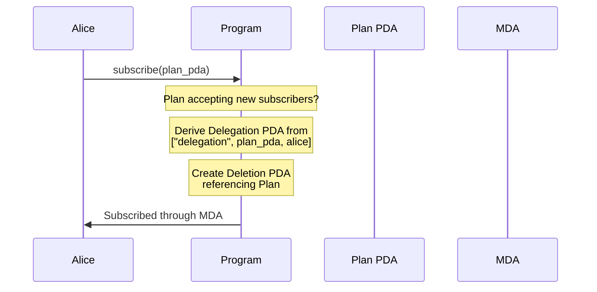
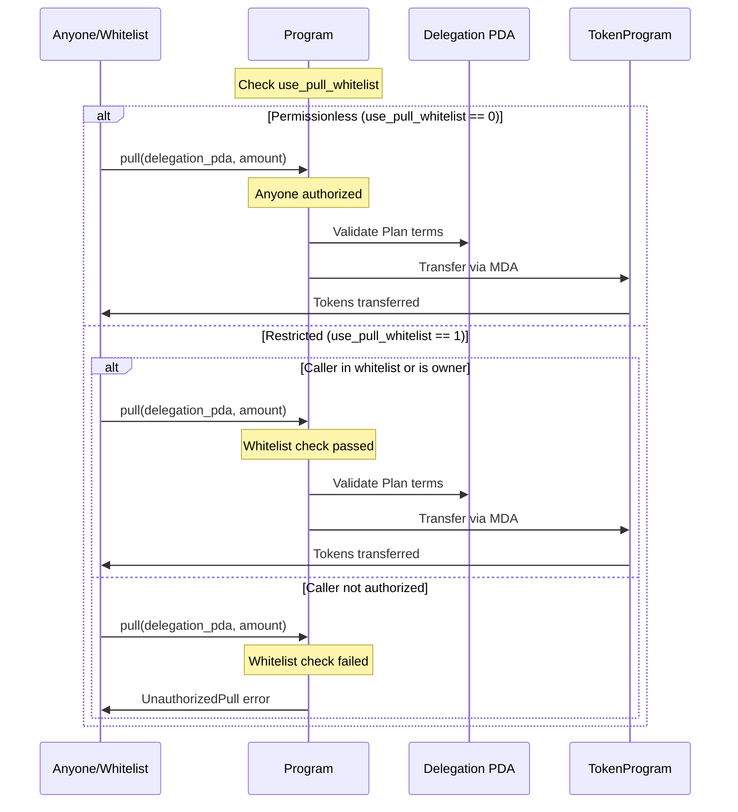
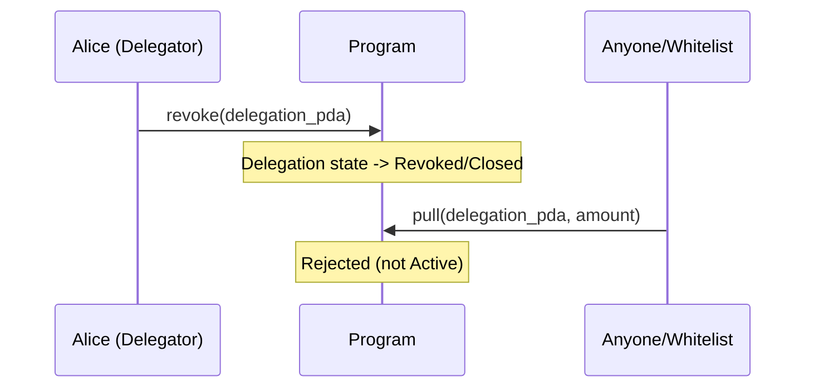
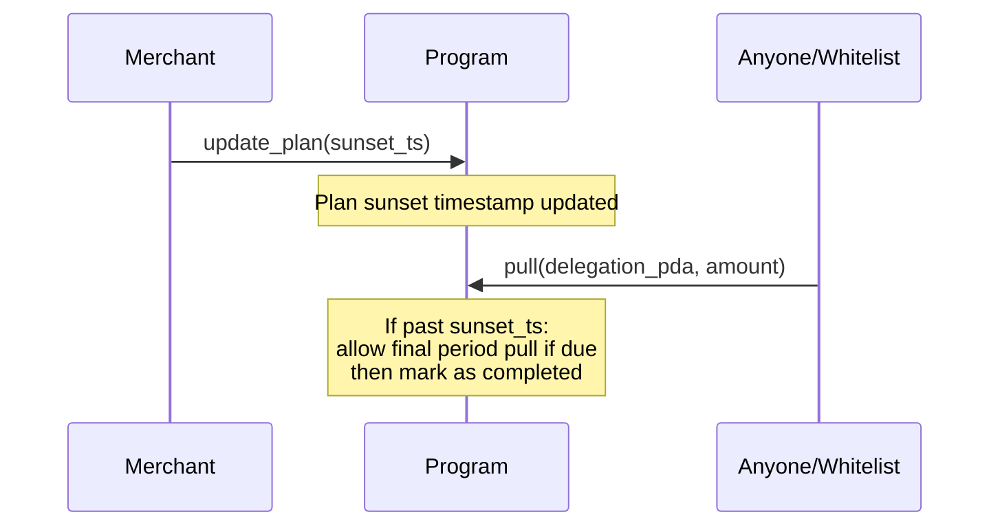

# ADR-002: Multi-Delegator Subscriptions (Plan Track)

**Status:** Draft

**Parent ADR:** ADR-001 - Multi-Delegator Program Architecture

## Context

ADR-001 implements a direct delegation model where delegators create Delegation PDAs with embedded terms for each delegatee. This works well for P2P, one-off, and bespoke delegations. However, subscription-based services and mass-market scenarios benefit from an additional pattern where:

**Both parties agree to terms in advance** - The merchant publishes immutable terms, subscribers verify and accept them.

**Use Cases:**

1. **Subscription Services**: Netflix, Spotify, or any SaaS where:
   - Merchants publish pricing plans once for all customers
   - Many users voluntarily subscribe to the same pre-verified terms
   - Terms remain immutable to establish trust

2. **Recurring Billing Platforms**: Payment processors where:
   - Merchants want centralized plan management
   - Subscribers independently verify terms before subscribing
   - Mutual agreement on pricing prevents disputes

3. **Marketplace Ecosystems**: DeFi or NFT platforms where:
   - Service providers publish standardized offerings
   - Users discover and subscribe via UI/SDK with term verification
   - Plan registries enable discoverability

**This is an Enhancement, Not Replacement:**
- ADR-001 flows remain fully available and intact
- Plans are built on top of the existing delegation structure
- Both models can coexist and are selected per use case
- Delegators always maintain their direct delegation capabilities

## Decision

Extend ADR-001 with a **Plan-based subscription layer** that:
1. Allows delegatees to publish reusable, immutable terms as Plans
2. Lets delegators subscribe to Plans, creating Delegation PDAs that reference the Plan
3. Uses the same MultiDelegate Authority (MDA) and transfer flows from ADR-001
4. Adds mutual agreement verification: delegators verify Plan terms before subscribing

### Architecture Overview

ADR-002 is an **add-on** to ADR-001 that introduces Plans while reusing all existing delegation infrastructure:



**Key Design Principles:**

1. **Add-On, Not Replacement**: ADR-002 extends ADR-001 without modifying core flows
2. **Mutual Agreement**: Plans enable both parties to verify and agree on terms before commitment
3. **Immutable Terms**: Once published, Plan terms cannot change (prevents mid-stream price hikes)
4. **Separate Controls vs Terms**: `update_plan` can modify metadata, whitelist, sunset - but NOT terms
5. **Unified Execution**: Subscriptions and direct delegations share the same MDA and transfer flows
6. **Coexistence**: Direct delegations (ADR-001) and subscriptions (ADR-002) operate simultaneously

### Rationale

**Why Add Plans to ADR-001?**

ADR-001 provides the core delegation infrastructure. Plans add a subscription model on top with these benefits:

1. **Mutual Term Agreement**
   - Both delegator and delegatee verify the same immutable Plan terms
   - Establishes clear, shared understanding before commitment
   - Prevents disputes - terms are visible to all parties

2. **Cost Efficiency for Merchants (Delegatees)**
   - One Plan PDA serves infinite subscribers
   - Per-subscriber cost is only the Delegation PDA (much smaller than Plan)
   - Example: 10K subscribers = 10K Delegation PDAs + 1 Plan (vs 10K separate delegations if using embedded terms

3. **Trust Model Through Immutability**
   - Merchants commit to terms via immutable Plan
   - Subscribers verify Plan terms before subscribing
   - No fear of arbitrary price changes mid-subscription
   - Builds trust for subscription-heavy use cases

4. **Discoverability and Ecosystem Growth**
   - Merchants publish Plans with metadata URIs (images, descriptions)
   - Plan discovery via `getProgramAccounts` and filtering
   - Enables subscription marketplaces and aggregators
   - Supports frontend SDKs for user-friendly subscription flows

5. **Management Flexibility**
   - `update_plan` allows:
      - Stop accepting new subscribers (when sunsetting service)
      - Configure pull whitelist (for controlled execution)
      - Set sunset timestamp (graceful discontinuation)
   - Without modifying core terms (pricing, periods, destination)

6. **Zero Breaking Changes to ADR-001**
   - All direct delegation flows continue working unchanged
   - Transfer logic is reused with Plan-provided terms instead of embedded terms
   - `use_pull_whitelist` configures authorization without modifying core transfer validation
   - Both models use the same MultiDelegate PDA infrastructure

7. **Opt-In Enhancement**
   - Use ADR-001 for: P2P, ad-hoc, customized delegations
   - Use ADR-002 for: Subscriptions, mass-market, standardized services
   - Users choose the approach that fits their use case

### Comparison to Direct Delegation

| Aspect | ADR-001 Direct Delegation | ADR-002 Plan Subscriptions |
|--------|------------------------|---------------------------|
| **Creation** | Delegator initiates | Delegatee publishes, delegators subscribe |
| **Terms Storage** | Embedded per delegation | Single Plan for all |
| **Cost Structure** | Full cost per delegation | Plan cost (1x) + Delegation cost (Nx) |
| **Term Mutability** | Per delegation | None (immutable after creation) |
| **Discoverability** | Manual PDA sharing | Plans can be discovered/marketplace |
| **Use Cases** | P2P, custom, one-off | Subscription services, SaaS, platforms |
| **Whitelist Control** | N/A (delegatee-only) | Configurable (permissionless or whitelist) |
| **Cancellability** | Not implemented (add later) | Delegator can revoke, Plan can sunset |

### Integration With ADR-001

ADR-002 is built **on top of** ADR-001's core infrastructure with **zero changes to existing flows**:

**Key Insight: Terms are Copied, Not Referenced**

The Plan serves as a **source of truth** for terms. When a delegator subscribes, the Plan's terms are **copied to the Delegation PDA** at creation time. This means:

| Flow | Terms Source | Result |
|------|-------------|--------|
| **Direct Delegation (ADR-001)** | User provides terms directly → | Copied to Delegation PDA |
| **Subscription (ADR-002)** | Plan contains terms → | Copied to Delegation PDA at subscribe |

**All Transfer Validation Logic Stays Identical:**
- `transfer_fixed` always reads `FixedDelegation.amount` and `expiry_s` from Delegation PDA
- `transfer_recurring` always reads period and tracking from Delegation PDA
- No changes needed - terms are always in the Delegation PDA, the same validation applies

**What Plans Add:**
1. **Publishable Terms:** Merchants publish Plans with immutable terms
2. **Verification:** Delegators can verify Plan terms before subscribing
3. **Copy on Subscribe:** When subscribing, Plan terms are copied to the new Delegation PDA
4. **Mutual Agreement:** Both parties see and agree to the same terms before delegation creation

**The Plan is Just a Template:**
- Plan = Published, reusable terms that delegators can subscribe to
- Subscribe = Create a Delegation PDA with a copy of the Plan's terms
- After subscription, the Delegation is self-contained and works exactly like ADR-001 delegations

**No Breaking Changes:**
- All ADR-001 instructions work unchanged
- Transfer validation code is identical for both models
- The `subscribe` instruction is the only new logic: it copies terms from Plan to Delegation

**Component Reuse:**

| Component | ADR-001 | ADR-002 |
|-----------|---------|---------|
| `MultiDelegate` PDA | ✓ Used | ✓ Same MDA |
| `FixedDelegation` structure | ✓ Embedded terms | ✓ Embedded terms (copied from Plan) |
| `RecurringDelegation` structure | ✓ Embedded terms | ✓ Embedded terms (copied from Plan) |
| `transfer_fixed` instruction | ✓ Reads from Delegation | ✓ Reads from Delegation (same) |
| `transfer_recurring` instruction | ✓ Reads from Delegation | ✓ Reads from Delegation (same) |
| **NEW** | - | `Plan` PDA (source of terms) |
| **NEW** | - | `subscribe` instruction (copies terms to Delegation) |

**Seeded Separation for Coexistence:**
- **Direct Delegations**: Seeds `["delegation", multi_delegate, delegator, delegatee, nonce]`
- **Subscription Delegations**: Seeds `["delegation", plan_pda, delegator]`
- Different seeds prevent PDA collisions
- Both can use the same MultiDelegate PDA simultaneously
- Both models can be used in the same program instance

**Example: How Terms Flows**

**ADR-001 Direct Delegation:**
- Alice provides terms directly to `create_fixed_delegation`
- Terms are written to the Delegation PDA
- Transfer validation reads these same fields later

**ADR-002 Subscription:**
- Plan contains terms (amount=1000, expiry=...)
- `subscribe` reads Plan terms and copies them to the Delegation PDA
- Result: Delegation is self-contained, same as ADR-001

**Transfer is identical for both:**
- `transfer_fixed` reads delegation.amount and delegation.expiry_s
- Works the same whether created via ADR-001 or ADR-002

**Flows Remain Available:**
- All ADR-001 instructions (`initialize_multidelegate`, `create_fixed_delegation`, `create_recurring_delegation`) continue to work unchanged
- New ADR-002 instructions (`create_plan`, `update_plan`, `subscribe`, `pull`) add subscription capability
- Direct delegations and subscriptions can be created and withdrawn independently
- Transfer validation code is shared and identical for both models

---

## Types

### Terms (Discriminator + Payload)

PlanTerms uses a discriminator + payload pattern for zero-copy compatibility with Pinocchio. The discriminator indicates the kind (Recurring or OneTime), and the payload contains the term-specific data.

### RecurringTerms (96 bytes)

Contains:
- `mint`: 32 bytes - Token mint
- `destination`: 32 bytes - Funds recipient
- `amount_per_period`: 8 bytes - Maximum pullable per period
- `period_secs`: 8 bytes - Seconds in each period
- `start_ts`: 8 bytes - Start timestamp
- `end_ts`: 8 bytes - End timestamp

### OneTimeTerms (72 bytes)

Contains:
- `mint`: 32 bytes - Token mint
- `destination`: 32 bytes - Funds recipient
- `amount`: 8 bytes - Maximum pullable amount

### Plan PDA

Contains:
- `owner`: 32 bytes - Merchant (Plan creator)
- `plan_id`: 8 bytes - Unique identifier
- `terms`: 104 bytes - Plan terms (Recurring or OneTime)
- `accepting_new_subscribers`: 1 byte - Can new delegators subscribe?
- `use_pull_whitelist`: 1 byte - Enable whitelist for pull
- `_padding`: 6 bytes - Alignment
- `sunset_ts`: 8 bytes - No renewals after timestamp
- `pull_whitelist`: 128 bytes - Allowed pullers (up to 4 addresses)
- `metadata_uri`: 128 bytes - Optional metadata

**PDA seeds**: `["plan", merchant, plan_id]`

**Pull Whitelist Logic:**
- `0`: Permissionless - anyone can call `pull`
- `1`: Restricted - only `owner` or addresses in `pull_whitelist`

---

## Instructions

### `create_plan` (Discriminator: 3)

Merchant publishes a Plan with terms.

| Account | Type | Description |
|---------|------|-------------|
| 0 | signer, writable | Merchant (Plan owner) |
| 1 | writable | Plan PDA to create |
| 2 | system_program | System program |

**Parameters:**
- `plan_id: u64` - Unique identifier
- `terms: PlanTerms` - Terms (RecurringTerms or OneTimeTerms)
- `metadata_uri: [u8; 128]` - Optional metadata

**Process:**
1. Validate PDA derived from `["plan", merchant, plan_id]`
2. Create Plan with owner, terms, defaults (accepting_new_subscribers=1, use_pull_whitelist=0)

### `update_plan` (Discriminator: 4)

Merchant updates Plan controls (metadata, whitelist, sunset), NOT terms.

| Account | Type | Description |
|---------|------|-------------|
| 0 | signer, writable | Plan owner |
| 1 | writable | Plan PDA to update |

**Parameters (all optional):**
- `accepting_new_subscribers: u8?` - Can new users subscribe?
- `sunset_ts: u64?` - No renewals after timestamp
- `use_pull_whitelist: u8?` - Enable/disable whitelist
- `pull_whitelist: [Pubkey; 4]?` - Allowed pullers
- `metadata_uri: [u8; 128]?` - Update metadata

**Process:**
1. Verify caller is Plan owner
2. Update provided fields (immutable: terms, plan_id, owner)
3. Rejected if trying to modify terms

### `subscribe` (Discriminator: 5)

Delegator subscribes to a Plan, **copying the Plan's terms to a new Delegation PDA**.

| Account | Type | Description |
|---------|------|-------------|
| 0 | signer | Delegator |
| 1 | | Plan PDA being subscribed to |
| 2 | writable | Delegation PDA to create (copy of Plan terms) |
| 3 | writable | MultiDelegate PDA (from ADR-001) |
| 4 | system_program | System program |

**Parameters:** None (terms come from Plan and are copied to Delegation)

**Process:**
1. Validate Plan exists and `accepting_new_subscribers == 1`
2. Derive Delegation PDA from `["delegation", plan_pda, delegator]`
3. **Create Delegation with terms copied from Plan:**
   - Copy `header.kind`, `header.delegatee` from Plan.terms
   - Copy delegation-specific terms (amount, expiry_s, etc.) from Plan.terms
   - Result: Delegation PDA is self-contained, identical structure to ADR-001 delegations
4. Delegation no longer references Plan - it's independent and uses same validation as direct delegations

**Key Point:** After subscription, the Delegation PDA is self-contained. The Plan is just a template that got copied. This means all transfer validation logic remains identical to ADR-001.

---

## Pull Instruction Design

**Note:** ADR-002 subscriptions use the same transfer instructions as ADR-001 (`transfer_fixed`, `transfer_recurring`). The only addition is a new `pull` instruction that validates Plan whitelist before delegating to the type-specific transfer.

**Process:**
1. Load the subscription Delegation PDA
2. Retrieve the associated Plan PDA
3. Check if Plan whitelist is enabled:
   - If disabled: Anyone is authorized to call pull
   - If enabled: Verify caller is Plan owner or in pull_whitelist
4. Load terms from Delegation PDA (same as ADR-001 direct delegations)
5. Validate and execute transfer using same logic as ADR-001

**Authorization Logic:**
- Direct delegations (ADR-001): Only delegatee can call transfer
- Subscription delegations (ADR-002):
  - If `use_pull_whitelist == 0`: Permissionless - anyone can call `pull`
  - If `use_pull_whitelist == 1`: Only `owner` or addresses in `pull_whitelist`

**Key Points:**
- The `pull` instruction validates whitelist, then delegates to the same transfer validation as ADR-001
- Transfer validation reads terms from Delegation PDA (same for both models)
- No changes to ADR-001's `transfer_fixed` or `transfer_recurring` logic

---

## Sequence Diagrams

### Merchant Creates Plan



### Alice Subscribes



### Whitelist Pull vs Permissionless Pull



### Delegator Revokes Subscription



### Merchant Sunsets Plan



---

## Security Model

| Attack | Prevention |
|--------|------------|
| Merchant changes terms mid-subscription | `update_plan` cannot modify terms field; rejects changes |
| Delegator can't verify terms | Terms stored in immutable Plan PDA; delegator verifies before subscribing |
| Unauthorized pull on restricted Plans | Whititelist check: only owner or pull_whitelist addresses |
| Delegator hijacks subscription | Delegation PDA seeds include plan_pda; can't be recreated |
| Plan expiration handling | `sunset_ts`; final payment if due then auto-cancel |
| Plan with invalid terms | Plan creation validates kind discriminators and payload structure |
| Orphaned Delegation reference | Delegation tracks state; pull instruction checks Plan reference |
| MDA spends without Plan constraint | Pull must validate Plan terms and Delegation constraints |

---

## Consequences

### Positive
- `+` **Cost Efficiency** - One Plan serves many subscribers
- `+` **Trust Through Immutability** - Terms fixed at creation prevent price changes
- `+` **Discoverability** - Plans can be published and discovered via marketplaces
- `+` **Flexible Control** - Whititelist vs permissionless pull, sunset mechanism
- `+` **Reuses ADR-001** - Shares MDA infrastructure, minimal code duplication
- `+` **Complementary** - Subscriptions and direct delegations can coexist
- `+` **Marketplace Enabling** - Standard structure for subscription services

### Negative
- `-` **Complexity** - Adds Plan management layer and additional instructions
- `-` **Rent Overhead** - Plan rent paid by merchants (though amortized over many delegations)
- `-` **Discovery Required** - Delegators must find Plans (vs direct PDA sharing)

### Neutral
- `~` **Mixed Authorization Models** - Direct delegations: delegatee-only; Subscriptions: configurable
- `~` **Shared Execution** - Can reuse transfer logic from ADR-001 or adapt to Plan terms
- `~` **Graceful Sunset** - Allows merchants to retire plans while honoring existing commitments

---

## Migration Path (If Needed)

Subscription Delegations would use different PDA seeds than direct delegations, so both models can coexist:

**Direct Delegation Seeds (ADR-001):**
```
["delegation", multi_delegate, delegator, delegatee, nonce]
```

**Subscription Delegation Seeds (ADR-002):**
```
["delegation", plan_pda, delegator]
```

This enables incremental rollout (start with direct, add subscriptions later) without breaking existing delegations.

---

## Future Enhancements

- Implement `pull` instruction with whitelist validation
- Plan marketplace/aggregator protocol for discovery
- Merkle tree for whitelists (scale beyond 4 addresses)
- Event logs for subscription lifecycle (subscribe, renew, expire)
- Subscription UI/SDK templates for frontend
- Analytics for merchants (active subscribers, total volume)
- Auto-renewal with Plan term modifications (version upgrades)