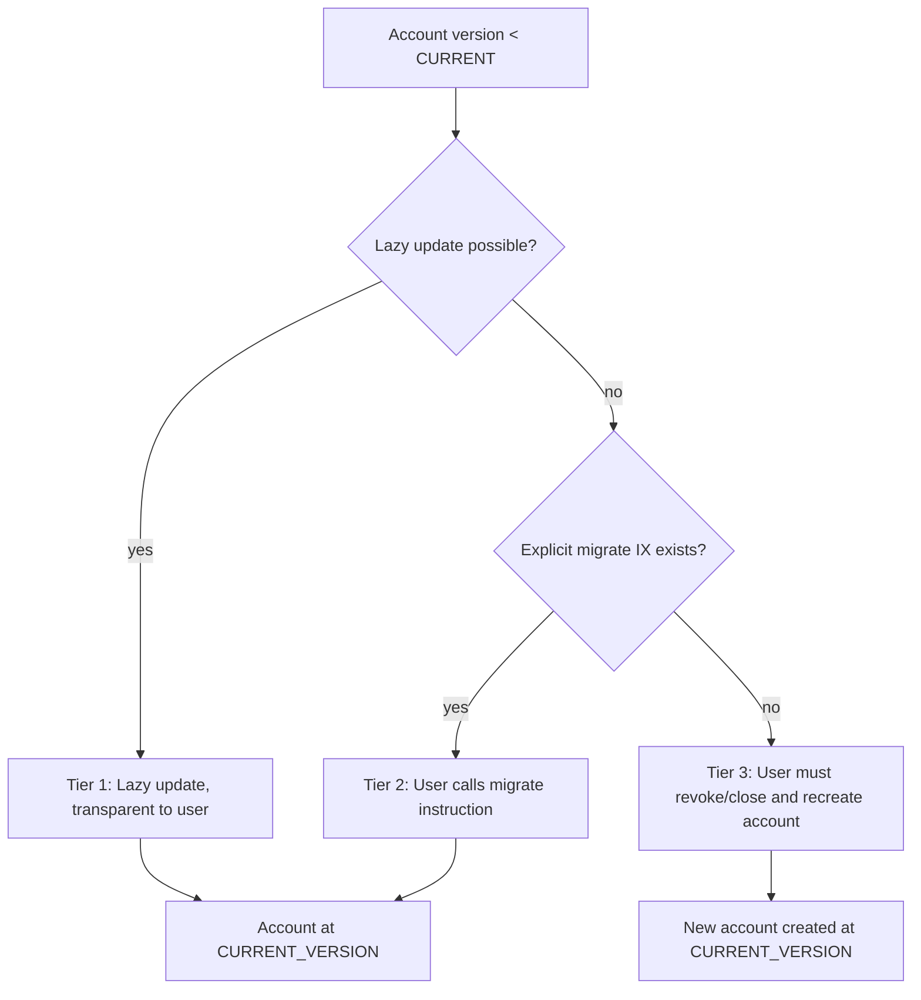
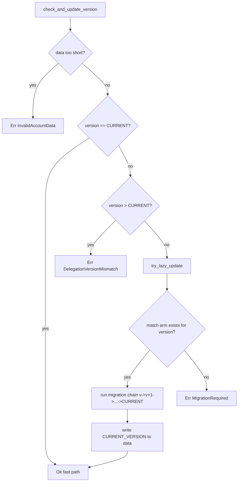
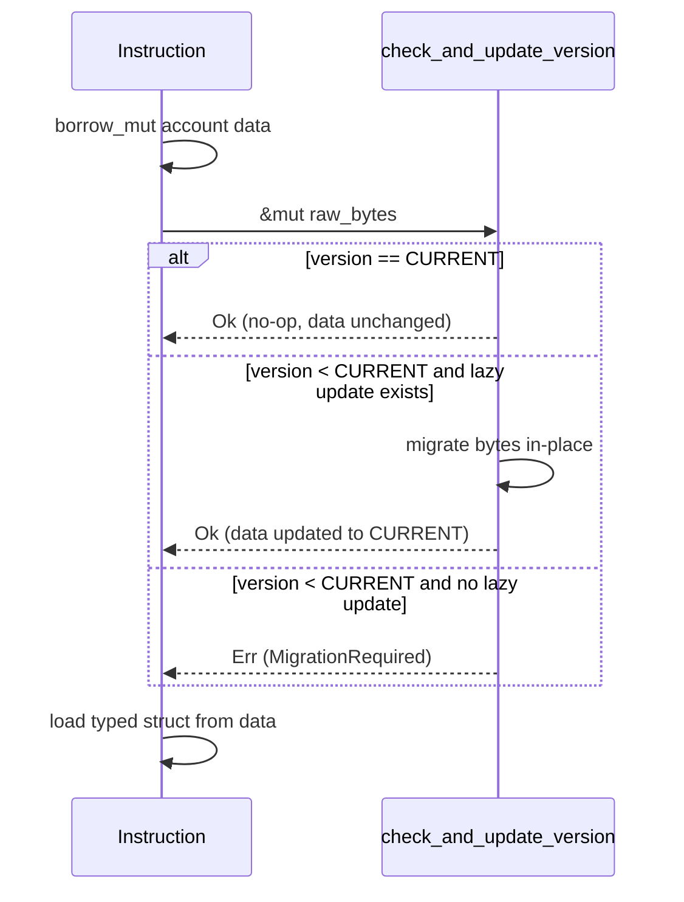

# 003 - Versioning & Migration Architecture

## Context

On-chain accounts persist indefinitely. When the program upgrades and struct layouts change,
existing accounts must be migrated. The system provides a three-tier fallback chain,
from fully transparent to worst-case manual intervention.

## Migration Fallback Chain



### Tier 1 - Lazy update (transparent)

Triggered automatically during normal instructions (transfer, cancel, revoke).
Transforms raw bytes in-place without realloc or extra accounts.

- **When**: field value transforms, new fields fitting in existing padding
- **User experience**: seamless, no extra action needed
- **Error on failure**: falls through to Tier 2/3

### Tier 2 - Explicit migration instruction (user action required)

A dedicated `migrate` instruction the user must call. Has access to additional
accounts and can perform realloc, create new PDAs, or do cross-account changes.

- **When**: account size increase, new associated PDAs, layout incompatible with in-place transform
- **User experience**: UI prompts user to sign a migrate transaction
- **Error**: `MigrationRequired` - signals the user must call the migrate IX
- **Note**: this instruction does not exist yet, it will be added when the first
  migration that needs it arises

### Tier 3 - Account recreation (worst case)

When neither lazy nor explicit migration can bring the account to the current version,
the user must revoke/close the old delegation or subscription and create a new one.

- **When**: fundamental schema incompatibility, deprecated account type, corrupted data
- **User experience**: UI explains the account cannot be migrated and guides recreation
- **Error**: `NeedsAccountRecreate` - signals the account must be closed and recreated
- **Note**: this error code does not exist yet, it will be added when the first
  migration that needs it arises. Currently `MigrationRequired` covers both Tier 2
  and Tier 3 since no migrations exist yet (CURRENT_VERSION == 1)

## Module Structure

```
state/
  versioning/
    mod.rs          # CURRENT_VERSION, check_and_update_version, try_lazy_update, check_min_account_size
    v1_to_v2.rs     # Stub: lazy_update + migrate for future v1->v2 transition
```

## Dispatcher Flow



## Account Header Layout

All delegation accounts (FixedDelegation, RecurringDelegation, SubscriptionDelegation) share a
common `Header` where:

- Byte 0: `discriminator` (identifies the account type via `AccountDiscriminator`)
- Byte 1: `version` (the schema version checked by `check_and_update_version`)
- Byte 2: `bump` (PDA bump seed)
- Bytes 3--34: `delegator`
- Bytes 35--66: `delegatee`
- Bytes 67--98: `payer`

The version check reads `data[VERSION_OFFSET]` (byte 1), not byte 0.
`MultiDelegate` and `Plan` accounts have their own layouts but also store a discriminator at
byte 0; versioning currently applies only to delegation accounts that use the shared `Header`.

## Instruction Integration

Version check runs **before** struct loading, on raw bytes:



Normal instructions (transfer, create) use exact-size `load`/`load_mut`.
Defensive instructions (revoke, cancel) use `load_with_min_size`/`load_mut_with_min_size`
so users can always reclaim funds from old-version accounts.


## Adding a New Version

1. Bump `CURRENT_VERSION` in `versioning/mod.rs`
2. Implement `lazy_update` in `vN_to_vN+1.rs`
3. Add match arm in try_lazy_update dispatcher: `N => { vN_to_vN1::lazy_update(data)?; v = N+1; }`
4. If lazy isn't possible, return `MigrationRequired` from `lazy_update` (Tier 2)
5. Add explicit `migrate` instruction if needed
6. If neither lazy nor explicit works, add `NeedsAccountRecreate` error (Tier 3)
7. Update tests

## Error Semantics

| Error | Tier | When | User Action |
|-------|------|------|-------------|
| `Ok` | - | version == CURRENT or lazy migration succeeded | None |
| `DelegationVersionMismatch` | - | version > CURRENT (program downgrade) | Use newer program |
| `MigrationRequired` | 2 | version < CURRENT, no lazy path, explicit migrate IX exists | Call migrate instruction |
| `NeedsAccountRecreate` | 3 | no migration path at all (future) | Revoke/close and recreate |
| `InvalidAccountData` | - | data too short for version byte | Account corrupted |

**Note**: `NeedsAccountRecreate` is not yet implemented. Currently `MigrationRequired`
covers both Tier 2 and Tier 3 since CURRENT_VERSION == 1 and no migrations exist.
When the first Tier 3 scenario arises, add the error code and split the handling.

## Size Check: check_min_account_size

Replaces strict `bytes.len() != Self::LEN` with `bytes.len() < Self::LEN`.

When `Self::LEN` grows in a new version, old accounts (smaller) would fail the strict check,
trapping rent lamports. The minimum-size check allows old accounts to load safely,
combined with `check_and_update_version` to ensure schema compatibility.
